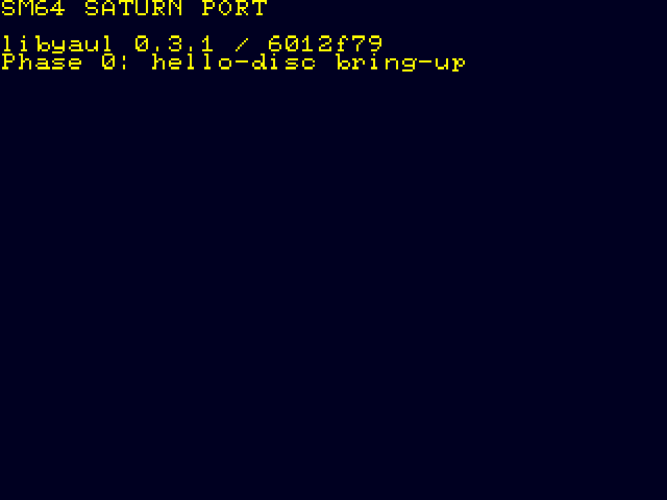
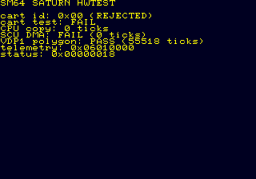
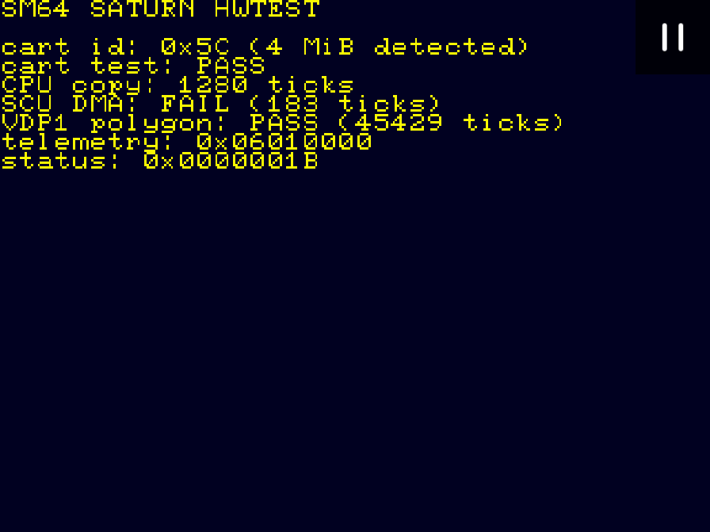
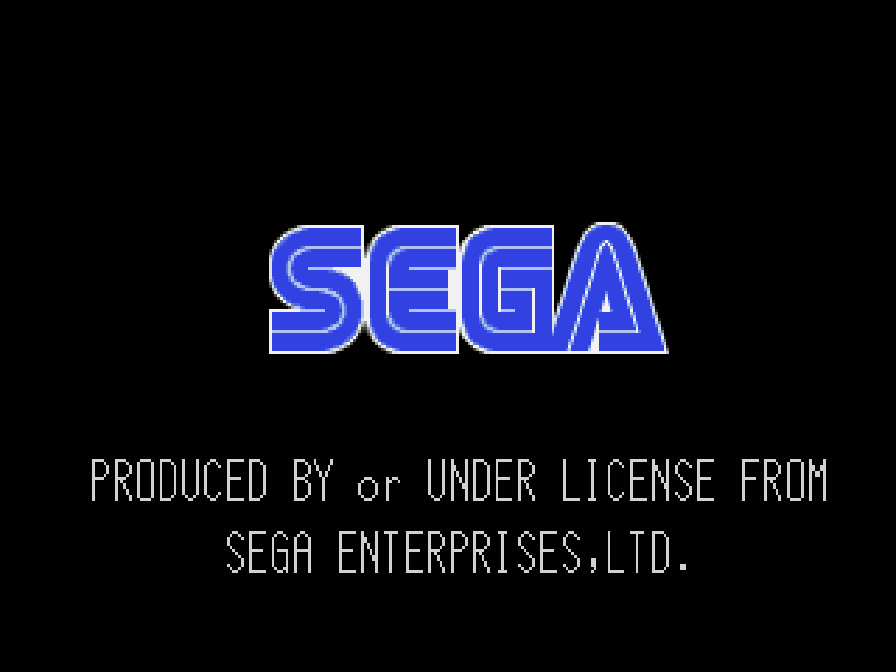
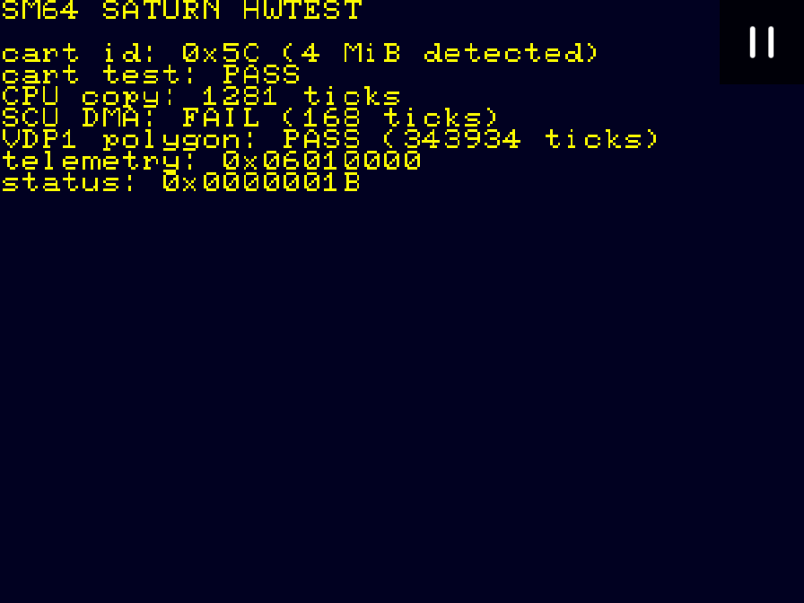
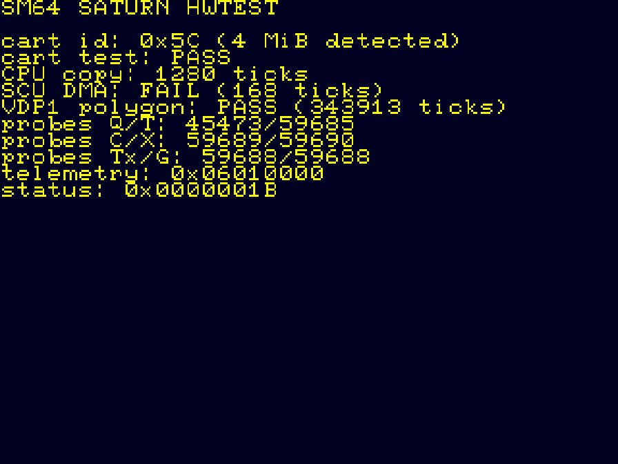
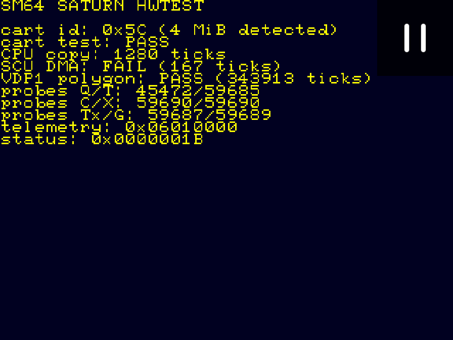
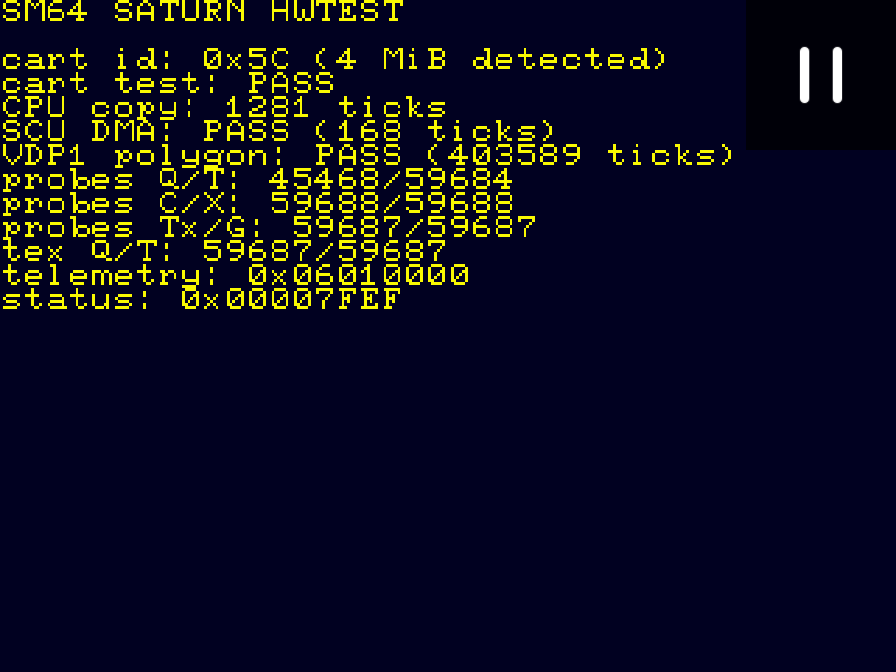
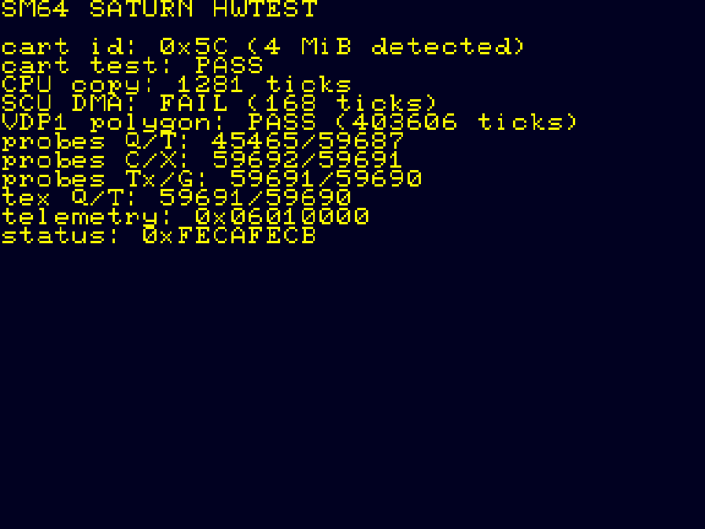

# Saturn port visual portfolio

Dated screenshots make emulator progress reviewable without confusing a
development-environment result with retail-hardware evidence. Each image is
checked into the repository and identified by SHA-256.

## 2026-07-17 capture set

### Phase 0: hello screen in Yabause HLE

The minimal boot artifact reaches the Saturn display path in the permissive
Yabause development configuration. SHA-256:
`f6c9b1acf25c2a230b4f308e30354da93c572645e20100841ef69c00262d2047`.

### Hardware-test rejection path in Yabause HLE

Yabause HLE visibly rejects the absent cartridge (`0x00`) while the
independent VDP1 polygon probe passes. This validates the failure UX and the
telemetry address, not real cartridge behavior. SHA-256:
`e19be1157f3774a9bdd64a056cc33b1c54a4a801905d7173fd456fb74315f6f0`.

### BIOS-backed 4 MiB cartridge path in Kronos

Kronos with the user-provided USA BIOS and `4M_extended_ram` reports ID
`0x5C`, passes the destructive 4 MiB memory test, and passes the VDP1 probe.
Its SCU-DMA result is currently `FAIL`; retail hardware must decide whether
that is an emulator limitation or a target-side bug. SHA-256:
`45eacab64f358cac2d1058b7d1b1cd09becd661835729ed99971b67a93cf1d40`.

### BIOS boot control

This control capture shows Kronos executing the real USA BIOS before the disc
run. It confirms the BIOS-backed configuration; it is not a game result.
SHA-256:
`687167326a799e5629f5f2e9a54a368b9b2e765227b7f808d18c9b01fb9d1cdb`.

### Per-probe VDP1 timing build

This capture is the corrected build where each primitive mode is submitted as
an independent command list. It visibly confirms the cart and renderer path;
the detailed per-mode timings are stored in the extended WRAM telemetry block.
SHA-256:
`1f6bfd46f530028d9e7aca382f897de3f4544e9d96ef4e0c4e805361d89e386c`.

### Visible per-probe timing screen

The latest diagnostic screen prints the independent timing slots directly:
quad/triangle, concave/transparency, textured/Gouraud, and the textured
repeated-vertex triangle. SHA-256:
`c81511f104b65b2e362edb2676ef039a51b48feed6715d992836e9b822a467a9`.

### Current post-assertion capture

This fresh 3,600-frame capture uses the current ISO after the telemetry ABI
assertions were compiled. It still visibly reports cart `0x5C`, cart PASS, and
all six per-probe timing slots. SHA-256:
`dad7c344a3a3ec52596bad6aac896e1e58024a70416ccca4fa68e07e7ee83a78`.

### Textured quad versus repeated-vertex triangle

The hardware disc now measures the exact textured representation split needed
for SM64 conversion. This capture reports `tex Q/T: 59687/59688` and a passing
SCU-DMA observation. SHA-256:
`752a78a1e3b62c8516d2f932ef323c840c911913cf0a4407a332aa4be5000908`.

A second full-length run reproduced the same visible result; its screenshot
SHA-256 is
`c57572a5756f8cd8fc20017b862c9932cb06f7c01ee9f673ebb875f8a89b99b1`.

### Completion bit visible in final status

The completion flag is now set before the final status line is rendered, so
the screenshot and the machine-readable WRAM contract agree. This run reports
`status: 0x80007FEF`; the screenshot SHA-256 is
`6a7bff930daaf600f87380372bb4d64ee55ec4553167ba8d05945bc0f79084b8`.

See the [capture record](evidence/kronos-complete-visible-2026-07-17.md) and
[manifest](evidence/reports/hwtest-kronos-complete-visible.manifest.json).

## Evidence ledger

| Capture | Emulator/configuration | What it proves | What it does not prove |
|---|---|---|---|
| Hello | Yabause HLE | Boot/display plumbing | Saturn timing or cartridge behavior |
| Hwtest rejection | Yabause HLE, 600 frames | Visible failure path, VDP1 probe, telemetry placement | Retail `0x5C` ID or DRAM timing |
| Hwtest 4 MiB | Kronos, USA BIOS, 4 MiB addon, 3,600 frames | BIOS-backed cart ID and destructive RAM test in an emulator | Retail bus timing; SCU-DMA discrepancy remains open |
| BIOS control | Kronos, USA BIOS | Correct BIOS-backed launch configuration | Disc/game execution |
| Current hwtest | Kronos, USA BIOS, 3,600 frames | Current ISO visual regression and telemetry screen | Retail bus timing; SCU-DMA discrepancy remains open |

See [the build procedure](BUILDING.md), [the hardware-test contract](HWTEST.md),
and the per-run [Kronos evidence record](evidence/kronos-hwtest-2026-07-17.md).

### Exact 4 MiB mapping gate

After adding the exact mapped-size guard, this BIOS-backed run visibly reports
`0x5C (4 MiB detected)` and `cart test: PASS`. Screenshot SHA-256:
`df90384033dfb2dc95e961898c56cddf33672b0f9aefd936845f7de2ff53a0fd`.
See the [capture record](evidence/kronos-size-gate-2026-07-17.md).
