# Saturn port visual timeline

This is the visual portfolio for the port. Each entry distinguishes a
boot/protocol diagnostic from an actual renderer result, and distinguishes
source-derived content from an original stand-in. Screenshots are evidence of
the named state only; emulator timing is not retail hardware evidence.

For a screenshot-first viewer, open [the visual timeline gallery](index.html).

| Stage | What it proves | Visual evidence |
|---|---|---|
| Hello disc | The first Yaul SH-2 disc reached a display through Yabause HLE. | [hello screen](screenshots/2026-07-17/hello-yabause-hle.png) |
| Hardware-test geometry | VDP1 can draw the test primitives, including textured/repeated-vertex triangles. | [textured triangle](screenshots/2026-07-17/hwtest-kronos-textured-triangle.png), [repeat-vertex triangle](screenshots/2026-07-17/hwtest-kronos-textured-triangle-repeat.png) |
| Hardware-test gate | Unsupported cartridge configurations fail visibly. | [size gate](screenshots/2026-07-17/hwtest-kronos-size-gate.png) |
| Ymir controller automation | The agent debugger selected English and advanced through the USA BIOS UI. | [English selection](screenshots/ymir-input-pulse-right-2026-07-17.png), [confirmation](screenshots/ymir-input-pulse-a-2026-07-17.png) |
| BIOS-backed hwtest | The fixed Ymir headless path authenticated the disc, loaded A.BIN, and completed the VDP1 hwtest. | [hwtest frame](screenshots/ymir-bios-hwtest-2026-07-17.png), [raw/report](ymir-bios-hwtest-2026-07-17.md) |
| Mario intro-face stand-in | Original VDP1 material-region study: cap, skin, hair, eyes, moustache, mouth, and collar. It is **not** a render of the original SM64 Mario mesh. | [intro-face study](screenshots/ymir-introface-2026-07-17.png) |
| Mario source-face topology | The VDP1 renderer projected all 440 original vertices and submitted all 877 original `mario_Face_FaceData` triangles from `src/goddard/dynlists/dynlist_mario_face.c`, each with a Gouraud table. The colors remain temporary material-ID mapping; geometry is source-derived. | [source-face frame](screenshots/ymir-source-face-2026-07-17.png), [capture report](ymir-source-face-2026-07-17.json), [provenance](../INTROFACE_PROVENANCE.md) |
| Mario source-face materials | The mesh extractor converted the same file's eight original `SetAmbient` material colors to RGB555: teeth/emblem/eyes, skin, hat shadow, hair, mouth, and cap. VDP1 uses them as Gouraud endpoints. | [source-material frame](screenshots/ymir-source-material-face-2026-07-17.png), [capture report](ymir-source-material-face-2026-07-17.json), [provenance](../INTROFACE_PROVENANCE.md) |
| Mario source eyes and pupils | The static front-pose renderer adds both original 48-vertex / 82-triangle eye objects from `dynlists_mario_eyes.c`, including blue irises, black pupils, and white highlights. | [source-eye frame](screenshots/ymir-source-eyes-face-2026-07-17.png), [capture report](ymir-source-eyes-face-2026-07-17.json), [provenance](../INTROFACE_PROVENANCE.md) |
| Mario eye alignment calibration | The first static transform was retained, measured against the source face eye-surface bounds, then corrected by right `(+5,-4)` and left `(-6,-4)` screen pixels. | [initial eye frame](screenshots/ymir-source-eyes-face-2026-07-17.png), [calibrated eye frame](screenshots/ymir-source-eyes-calibrated-2026-07-17.png), [capture report](ymir-source-eyes-calibrated-2026-07-17.json) |
| Mario eye-size calibration | The separate source eye meshes were reduced to 2/3 around their matching source eye-surface centers so irises/pupils sit inside the white face geometry. | [scaled-eye frame](screenshots/ymir-source-eyes-scaled-2026-07-17.png), [capture report](ymir-source-eyes-scaled-2026-07-17.json) |
| Topology-derived Gouraud depth | Per-vertex normals are accumulated from the 877 source triangles and evaluated against an upper-left key light, producing continuous VDP1 Gouraud lighting on the face. | [Gouraud frame](screenshots/ymir-source-gouraud-2026-07-17.png), [capture report](ymir-source-gouraud-2026-07-17.json) |
| Rejected raw-feature placement | The first feature import drew every moustache triangle after the face, placing it over the nose and making its otherwise-correct source scale and black material read like an oversized cutout. Preserved as a failure, not accepted renderer progress. | [failure frame](screenshots/ymir-source-features-2026-07-17.png), [capture report](ymir-source-features-2026-07-17.json), [provenance](../INTROFACE_PROVENANCE.md) |
| Intermediate reduced moustache | A 3/4-scale dark-brown calibration proved that shared Z sorting fixes nose occlusion, but unnecessarily changed two source-authentic properties. Preserved as an intermediate correction. | [intermediate frame](screenshots/ymir-features-calibrated-2026-07-17.png), [capture report](ymir-features-calibrated-2026-07-17.json), [provenance](../INTROFACE_PROVENANCE.md) |
| Source-scale black moustache | The accepted correction restores the original scale, position, and black material while retaining the unified face/feature Z sort. The nose now occludes the full source silhouette correctly. | [accepted frame](screenshots/ymir-mustache-source-scale-2026-07-17.png), [capture report](ymir-mustache-source-scale-2026-07-17.json), [provenance](../INTROFACE_PROVENANCE.md) |
| Goddard-profiled shine | The exact 32x32 IA8 shine map was extracted from a hash-validated user-owned US ROM and measured without committing the asset. Its narrow lobe is close-ported as a fixed-point specular term in the existing VDP1 Gouraud endpoints. | [shine frame](screenshots/ymir-face-shine-2026-07-17.png), [capture report](ymir-face-shine-2026-07-17.json), [provenance](../INTROFACE_PROVENANCE.md) |
| Interactive face loop | The static proof now runs every VBlank with fixed-point yaw/pitch/zoom projection, camera-aware painter sorting, persistent VDP1 command storage, cached per-vertex lighting, an A-button shine switch, B-button auto-orbit, and a live timing/pad HUD. | [interactive frame](screenshots/ymir-interactive-face-2026-07-17.png), [capture report](ymir-interactive-face-2026-07-17.json), [provenance](../INTROFACE_PROVENANCE.md) |
| Renderer cost split | Source inspection of SlaveDriver, Jo Engine, and Sonic Z-Treme led to an explicit four-way HUD measurement: painter sort, transform/command build, conditional Gouraud upload, and render wait. The BIOS-backed Ymir capture shows the counters over the actual source-derived face; emulator timing remains comparative evidence only. | [telemetry frame](screenshots/ymir-renderer-telemetry-2026-07-17.png), [capture report](ymir-renderer-telemetry-2026-07-17.json), [prior-art decision](../RENDERER_PRIOR_ART.md) |
| Controller polling repair | The demo now initializes SMPC before registering the libyaul-style VBlank INTBACK callback and processes a sample every loop. A bounded Ymir Right hold reaches the Saturn program as `DOWN 8000` and changes the rendered framebuffer from the neutral baseline. | [neutral frame](screenshots/ymir-input-neutral-2026-07-18.png), [Right-held frame](screenshots/ymir-input-right-held-2026-07-18.png), [capture report](ymir-input-right-held-2026-07-18.json), [provenance](../INTROFACE_PROVENANCE.md) |
| Remote release follow-up | Preserved automation limitation: after Ymir removes its persistent pad override, the most recent Saturn-side sample remains latched as `DOWN 8000` in this run. Manual SDL input is ready for retest, but deterministic remote release is not yet claimed. | [latched-release frame](screenshots/ymir-input-right-2026-07-18.png), [capture report](ymir-input-right-2026-07-18.json) |
| Painter/vertex cache pass | The first performance pass retains the preceding frame's nearly sorted order, caches one depth per surface, and transforms/projects each of the 440 shared face vertices once per frame. This removes repeated fixed-point work without changing source topology or the Gouraud result. Manual SDL testing on 2026-07-18 changed the result from “incredibly slow” to “much much faster, much better,” accepting the interaction improvement while leaving retail-hardware timing unclaimed. The next measured risk is VDP1 command cost from 1,049 repeated-vertex triangle commands. | [optimized frame](screenshots/ymir-sort-cache-2026-07-18.png), [capture report](ymir-sort-cache-2026-07-18.json), [renderer decision](../RENDERER_PRIOR_ART.md) |
| Conservative true-quad compiler | A host-side Saturn render IR preserves all 877 SM64 source triangles but replaces 156 validated pairs with real VDP1 quads. Strict material, winding, normal, and 15-view projected-convexity gates leave 565 face triangles as explicit fallbacks. Total draw commands fall from 1,213 to 1,057 without changing the visible face silhouette, feature occlusion, eyes, or shine. | [quad frame](screenshots/ymir-true-quads-2026-07-18.png), [capture report](ymir-true-quads-2026-07-18.json), [pairing audit](reports/introface-quad-pairing.json), [provenance](../INTROFACE_PROVENANCE.md) |
| Exact blossom quad matching | Hash-pinned NetworkX 3.6.1 replaces the local pairing heuristic with exact maximum-cardinality, maximum-integer-quality matching. It proves that 156 is the maximum among 206 safe candidates and improves three pairing records without changing command count. The resulting capture changes only nose shading: 610 color pixels and zero foreground-mask pixels versus the heuristic build. | [exact frame](screenshots/ymir-exact-quads-2026-07-18.png), [capture report](ymir-exact-quads-2026-07-18.json), [pairing audit](reports/introface-quad-pairing.json), [provenance](../INTROFACE_PROVENANCE.md) |
| Reusable mesh IR v1 | The 440-vertex face now enters the same versioned compiler interface intended for animated actors. The audit artifact preserves 877 source triangle IDs, 41 ordered Goddard joints, and 506 unnormalized Q15 weight records before producing the same 721 VDP1 primitives. The BIOS-backed framebuffer hash is exactly identical to Stage 15, proving no neutral-render regression. | [IR regression frame](screenshots/ymir-mesh-ir-v1-2026-07-18.png), [capture report](ymir-mesh-ir-v1-2026-07-18.json), [compiled mesh IR](reports/introface-mesh-ir.json), [IR contract](../SATURN_MESH_IR.md) |
| Animated-disc boot timing | The first rebuilt-disc automation capture stopped at the Sega BIOS logo after 2,100 frames. Extending the same deterministic USA-BIOS macro to 3,300 frames reached the target, so this is preserved as a boot-timing diagnostic rather than a renderer result. | [boot-delay frame](screenshots/ymir-eyelid-animation-first-2026-07-18.png), [report](ymir-eyelid-animation-first-2026-07-18.json) |
| Rejected animated-quad frame | The first eyelid animation pass applied raw source eyelid streams to the weighted face while retaining every neutral-pose true quad. At a deterministic later phase, a deformed quad produced an incomplete face. Repeating the same 3,500-frame route produced the identical broken hash, so this is a renderer-safety failure rather than a capture race. | [failure frame](screenshots/ymir-eyelid-animation-later-phase-2026-07-18.png), [repeat report](ymir-eyelid-animation-later-phase-repeat-2026-07-18.json) |
| Animation-safe eyelid fallback | The compiler now forbids merging any source triangle that touches one of the 42 eyelid-weighted face vertices until a full pose-complete Goddard evaluator exists. This leaves 130 static true quads and emits 108 animated-region triangles as explicit VDP1 fallbacks; the same later phase again renders the complete source face. This is an initial source-stream deformation study, not yet a full Goddard joint-matrix implementation. | [accepted frame](screenshots/ymir-eyelid-animation-triangle-fallback-2026-07-18.png), [capture report](ymir-eyelid-animation-triangle-fallback-2026-07-18.json), [pairing audit](reports/introface-quad-pairing.json) |
| Rejected VDP2 title-layer probe | The first M1 NBG1 bitmap staging attempt was deliberately tested through three compositor variants. The final priority probe proves NBG1 is active but black in Ymir; it must not replace the working face scene yet. The face capture immediately before it also confirms the eye surface/pupil/glint ordering correction. This failure now requires a standalone minimal Yaul bitmap probe before reintegration. | [eye-order frame](screenshots/ymir-m1-vdp2-layer-correction-2026-07-18.png), [black-plane failure](screenshots/ymir-m1-vdp2-cache-resolved-2026-07-18.png), [capture report](ymir-m1-vdp2-cache-resolved-2026-07-18.json) |
| Accepted VDP2 title field | A standalone NBG1 probe isolated the missing VDP2 VRAM cycle-pattern allocation. Close-porting Yaul's NBG1 fetch-slot pattern for banks A0/A1 makes the RGB555 staging field visible behind the VDP1 Mario face in the integrated Ymir capture. This is an original temporary field; it is not a redistributed SM64 title asset. | [standalone probe](screenshots/ymir-vdp2probe-cycle-pattern-2026-07-18.png), [integrated frame](screenshots/ymir-m1-vdp2-cycle-resolved-2026-07-18.png), [capture report](ymir-m1-vdp2-cycle-resolved-2026-07-18.json) |
| M1 VDP2 prompt | The player-facing `PRESS START` prompt is rasterized into the proven NBG1 title bitmap, avoiding the still-instrumentation-only NBG3 debug font path. It is correctly behind VDP1 Mario, so the face occludes its center; a Start edge replaces it with `STARTED`. | [accepted title frame](screenshots/ymir-m1-press-start-accepted-2026-07-18.png), [capture report](ymir-m1-press-start-accepted-2026-07-18.json) |
| Original title glyphs | The title prompt now uses locally generated N64 source HUD glyph pixels, converted from the user-owned US ROM into Saturn RGB1555 at build time. The derived header and ROM hash manifest stay uncommitted under `build/`; only the converter and evidence are tracked. | [source-glyph frame](screenshots/ymir-m1-source-press-start-2026-07-18.png), [capture report](ymir-m1-source-press-start-2026-07-18.json), [provenance](../INTROFACE_PROVENANCE.md) |
| Corrected source prompt + eyelid ordering | The first source-glyph pass read MIO0-compressed Segment 2 bytes directly and produced a noisy strip. The local converter now decompresses Segment 2 as the project extractor does, restoring the colorful original HUD glyphs. Strongly weighted upper-face primitives are also composed ahead of the independent eye meshes, making the eyelid contour visible over the eyes. | [accepted frame](screenshots/ymir-m1-source-glyphs-eyelid-occlusion-2026-07-18.png), [capture report](ymir-m1-source-glyphs-eyelid-occlusion-2026-07-18.json), [provenance](../INTROFACE_PROVENANCE.md) |
| Source-derived eyelid joint pose | The target now evaluates the same Goddard rest-joint inverse/current-joint transform used by `reset_weight()` / `move_skin()`: original eyelid pivots, static net yaw, `GD_ANIM_ROT3S` keyframes, and Q15 influences drive the original face vertices. The high-pose capture visibly closes the upper face over the independent source eye objects; it is not a screen-space lid substitute. | [neutral-pose frame](screenshots/ymir-m1-source-eyelid-joint-2026-07-18.png), [high-pose frame](screenshots/ymir-m1-source-eyelid-joint-highpose-2026-07-18.png), [high-pose report](ymir-m1-source-eyelid-joint-highpose-2026-07-18.json), [provenance](../INTROFACE_PROVENANCE.md) |
| Open-pose pupil composition | The first joint pose proof established that the real eyelid mesh moves, but pupils could still sort behind its independent eye/face surfaces. Pupil triangles now receive foreground priority only while the source eyelid rotation is within an open-pose threshold; a closed source lid remains free to occlude them. | [open-pose frame](screenshots/ymir-m1-source-eyelid-pupil-open-2026-07-18.png), [capture report](ymir-m1-source-eyelid-pupil-open-2026-07-18.json) |

## Source-face gallery

### Material conversion

### Eye placement iteration

### Topology-derived Gouraud lighting

### Rejected: raw moustache and eyebrow placement

The source objects are valid, but this direct projection is not. The moustache
must follow its Goddard net/skin transform and correct depth/material behavior.

### Corrected static feature calibration

### Accepted source-scale black moustache

### Goddard-profiled VDP1 shine

### Interactive camera and lighting benchmark

### Reusable mesh IR regression

### Rejected: neutral-pose quads during eyelid deformation

### Accepted: animated eyelid region as triangle fallbacks

### Rejected: first VDP2 title-layer integration

This is preserved rather than presented as a title backdrop. A standalone Yaul
NBG1 bitmap probe is now the gate before bringing the backdrop back into the
interactive face scene.

### Accepted: VDP2 title field under the VDP1 Mario face

The field is an original diagnostic backdrop. The missing cycle-pattern fetch
slots were adapted from Yaul's permissive `vdp2-normal-bitmap` example; a
local, non-redistributed SM64 source asset conversion remains the next step.

### M1: VDP2-native PRESS START

The prompt deliberately shares the title field and is therefore occluded by
Mario where they overlap. START changes the prompt bitmap to `STARTED`; the
deterministic input-duration/handoff proof is still outstanding.

### M1: original local source glyphs

The colorful glyphs are converted locally from the user-owned US ROM and are
not part of the repository. The tracked converter preserves the reproducible
source-to-Saturn route without redistributing Nintendo art.

### Corrected original glyph decoding and eyelid foreground

The prior glyph result read compressed Segment 2 bytes as pixels. The current
route decompresses first, and the eyelid face primitives now compose ahead of
the independent eye objects.

### Actual source eyelid joint pose

This replaces the earlier vertical-offset study. The face vertices are moved
through the source rest-joint inverse/current-joint transform and blended by
the original Q15 skin weights; no screen-space eyelid geometry is used.

### Open-pose pupil occlusion correction

Pupil triangles are foreground only while the actual source eyelid is open.
The threshold is deliberately not applied to closed poses, where the animated
source skin must remain the occluder.

### Closed-pose pupil occlusion correction

The capture-only build locks both original eyelid tracks to source frame 699,
where their roll values are maximally separated from rest. The complete eye
objects are submitted behind the deformed lid at this pose, so neither pupil
nor white leaks through. Normal builds retain the moving source animation;
the deterministic lock exists only to make this boundary reproducible.

### M2 rejected: initial in-game actor assembly

This is the first runtime capture of the normal in-game Mario actor stream:
788 triangles directly extracted from actors/mario/model.inc.c and the
mario_geo_body branch. It is deliberately preserved as a failure. The
translation-only staging evaluator is not yet equivalent to the source
GeoLayout transform stack, so the body is exploded rather than presented as
a Mario silhouette.

### M2 rejected: wrong actor-basis projection

The fast source-order path presents correctly, but this capture proves that
the attempted X-up camera conversion projects the actor offscreen. The next
implementation gate is a source GeoLayout evaluator, not further camera
calibration guesses.

### M2 accepted plumbing: unmasked source Mario actor

This capture is 788 triangles directly generated from the project’s
`actors/mario/model.inc.c`, selected by the evaluated `mario_geo_body`
GeoLayout branch, then submitted to VDP1. It proves the in-game source actor
reaches the Saturn display path. The fractured silhouette is expected: each
source triangle is still a repeated-vertex temporary VDP1 quad, so it is not
yet a quality, animation-safe presentation. The preceding VDP1 command probe
and depth-bucket captures are retained as rejected diagnostic evidence.

### M2 accepted: native-basis standing Mario IR

The actor now evaluates its native `mario_geo_body` basis correctly: source X
is screen-up, source Z is horizontal, and source Y is view depth. Its 788
source triangles compile into 183 accepted true VDP1 quads and 422 explicit
triangle fallbacks. This is an upright source actor geometry proof; it still
uses the temporary source-light RGB fallback, before texture conversion and
Gouraud lighting.

### M2 accepted: native VDP1 Gouraud actor lighting

The same upright source actor now uses one VDP1 Gouraud table per compiled
primitive. Tables are built from accumulated source-mesh vertex normals and
uploaded through Yaul's SCU DMA path; the command mode explicitly selects
`VDP1_CMDT_CC_GOURAUD`. This is visible target lighting, not a flat-material
stand-in. Original Fast3D texture state remains the next fidelity gate.

### M2 rejected: first original texture submissions

The first local-ROM texture converter initially read Mario's MIO0-compressed
segment as pixels; decoding the segment corrected those words. The following
VDP1 distorted-sprite pass still masks the actor because it maps a rectangular
texture over a non-rectangular Fast3D eye patch. Both captures are retained:
the assets are now correct, while the renderer still needs per-primitive UV
tessellation rather than an overlay approximation.

### M2 rejected: UV tiles submitted after the actor

All 11 original `mario_eyes_cap_on_dl` position/UV triplets now bake into
transparent 16×16 VDP1-safe tiles, proving the local source-texture path is
active. This frame is rejected: its tile commands were appended after the
whole actor and therefore overpaint cap and face. The texture replacement
must occupy the original compiled primitive span. Separately, this capture
also makes clear that the current no-animation joint pose is not a credible
standing Mario pose; source skeletal evaluation is now the higher-priority
gate.

### M2 intermediate: source Animation / GeoLayout world pose

This replaces the translation-only actor staging with a close port of
`mtxf_rotate_xyz_and_translate`, `mtxf_mul`, and the source Animation
index/value channel cursor used by `geo_process_animated_part`. The evaluated
world pose is Y-up. It remains an intermediate gate, not a pose acceptance:
the later front-facing capture exposed a hierarchy-stack error in this first
evaluator. The C5 data and source geometry are valid; the local GeoLayout walk
was not yet restoring the parent matrix after a child subtree.

### M2 rejected: in-place eye tiles need affine subdivision

The source eye range is now regenerated after the Animation/GeoLayout pose and
replaces compiled primitives 146–152 in its original order; VDP1 Gouraud
remains active for all surrounding source primitives. This fixes the prior
overpaint boundary, but an individual repeated-vertex VDP1 distorted sprite
still does not approximate Fast3D's per-triangle UV interpolation closely
enough to show a legible eye. The next texture gate is adaptive UV subdivision
into smaller VDP1-safe tiles, not another screen-space overlay.

### M2 rejected: four-way UV subdivision has no visible contribution

The converter now emits four affine source-space subtriangles for each of the
11 original eye triangles (44 tiles total). The deterministic Ymir framebuffer
hash is exactly the Stage 36 hash, proving the selected eye patch does not
contribute visibly in this C5 presentation. This rules out simply increasing
tile density; the next gate is a source-facing standing frame/camera proof
before more texture commands are added.

### M2 rejected: face-facing camera still masks the eye patch

The source eye centroid establishes positive Z as the face direction, and the
zero-yaw capture has a distinct deterministic frame hash. It still lacks a
visible eye patch, ruling out camera direction and UV subdivision as the
immediate cause. M2 currently preserves source-stream primitive submission;
after articulated transforms, that is insufficient painter ordering. The next
required renderer gate is depth ordering of the transformed primitives before
the eye texture path can be judged visually.

### M2 intermediate: transformed depth buckets restore the body silhouette

Submitting far transformed buckets before near buckets materially restores the
body silhouette and preserves the VDP1 Gouraud gradients. The capture is
still a rear presentation—so the eye patch being hidden is expected rather
than evidence against the texture converter. The next camera gate derives the
turntable front direction from the source face surface normal, rather than
the patch centroid alone.

### M2 rejected: front camera exposes a hierarchy-stack defect

The wider, front-facing capture is retained as a rejected visual checkpoint.
It conclusively shows that the remaining problem is not camera distance or
face direction: later arm and leg siblings inherited transforms from earlier
child joints. The evaluator is now corrected to match SM64's
`geo_process_animated_part` push/recurse/pop stack discipline. A rebuilt
capture is required before any pose is called standing or accepted.

### M2 stack correction: rear view restores the articulated body

The first rebuilt capture removes the collapsed sibling transforms visible in
Stage 40. It provides an independent rear-view proof that the source cap,
torso, gloves, overalls, and feet now inherit their own intended joints.

### M2 accepted: source GeoLayout stack restores standing Mario

The rebuilt front view verifies the stack correction on target: the cap, face,
torso, arms, gloves, legs, and feet now remain attached to their intended
source hierarchy branches. The face includes the converted original eye-patch
texture, while the rest of the actor uses VDP1 Gouraud shading derived from
the actual compiled Mario geometry. This is the first accepted standing-body
pose; remaining M2 work is texture coverage and painter-quality refinement,
not a substitute geometry path.

### M2 texture coverage: five original Mario textures reach VDP1

The adapter now tracks Fast3D `gsDPSetTextureImage` state through nested source
display lists, marks those source triangles unsafe for quad pairing, and
replaces each one in transformed painter order with four UV-baked VDP1 tiles.
This capture exercises 50 original textured source triangles (200 tiles): cap
logo, eyes, sideburns, mustache, and overalls buttons. The body remains source
geometry with VDP1 Gouraud shading. UV-tile seams and per-subtile ordering are
visible limitations to refine, not missing or invented texture data.

### M2 accepted: root rotation completes the source standing pose

The final source-animation cursor correction is decisive. In SM64,
`geo_process_animated_part` consumes root translation and then its root
rotation in the *same* invocation. The earlier evaluator skipped that rotation,
offsetting every limb channel. With the true cursor order, the source C5 idle
places the head near +153 source Y and both feet near −125 source Y. This
BIOS-backed capture shows an upright Mario with source geometry, five local
ROM-derived texture sources, and native VDP1 Gouraud lighting together.

### M2 rejected: 256 transformed-depth buckets do not improve this view

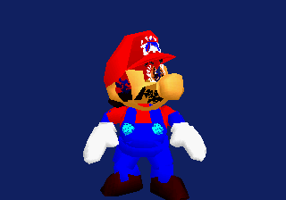

The body submits through 256 bounded transformed-depth buckets rather than 64.
Although that remains a valid Saturn-native integer painter experiment, this
capture is visibly worse rather than better in the legs, feet, and torso. It
is retained as a rejected ordering configuration; the project must not claim
that bucket count alone stabilizes the articulated actor.

### M2 Saturn cleanup: Gouraud reaches original texture tiles

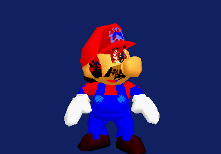

Yaul's VDP1 RGB1555 distorted-sprite path accepts the same Gouraud color-calc
mode used by the polygon body. Texture subtiles now reference their originating
compiled primitive's table, so the source cap/face patches no longer form a
separate unlit rendering path. This retains a small Saturn-native command/data
model: no software lighting pass, shader, or Z buffer was introduced.

### M2 rejected: late texture pass worsens painter ordering

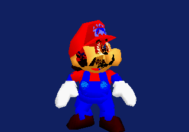

This BIOS-backed experiment drew opaque source geometry before the UV-baked
texture tiles. It visibly worsens the actor's painter ordering and overpaints
surfaces that were at least coherent in the baseline. The baseline transformed
painter order is retained. The experiment is evidence that a late VDP1 texture
pass cannot stand in for depth-aware decals; the next correctness work targets
the tile mapping and a proper later-pass design rather than this shortcut.

### M2 neutral experiment: VDP1 winding normalization does not repair painting

The 50 source texture triangles were compared against Yaul's repeated-vertex
distorted-sprite test convention; 44 had the opposite front-camera screen
winding. Flipping both their position and UV order produced no material visual
improvement in the BIOS-backed frame. The camera-specific normalization is
therefore rejected and reverted. A patterned hardware texture probe—not a
further guessed actor conversion—is the next texture correctness gate.

### M2 accepted conversion correction: measured VDP1 texel corner order

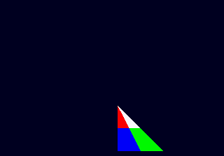

The visible target probe establishes the actual repeated-vertex distorted
sprite mapping: source tile corners land at C, B, A, and the collapsed fourth
edge, rather than the intuitive A, B, C ordering. Opaque direct-color texels
also require the MSB set; this matches the N64 RGBA16 alpha-to-Saturn-MSB
conversion already used by the local Mario asset bake.

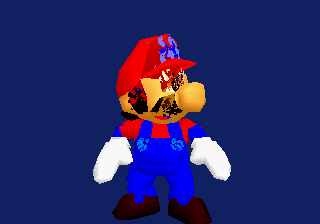

The Mario baker now emits its UV samples in C/B/A tile order and preserves a
transparent fourth edge. The ROM-derived header is regenerated explicitly
through `compile-mario-textures` before a target build, preventing the stale
derived-header false negative caught during this experiment. This is a real
texture-layout correction on the native VDP1 path, while the 16×16 fallback's
resolution and remaining painter limitations stay visible and open.

### M2 rejected: 32×32 texture tiles exhaust residency without a visible win

The expanded 200-tile bake consumed 409,600 of Yaul's 442,336 default VDP1
texture bytes. At the 320×224 front turntable view it did not provide a
meaningful visual improvement over the 16×16 C/B/A-corrected bake. It is
rejected and the compact 102,400-byte version is retained, reserving texture
residency for the upcoming Castle scene.

### M3 accepted: first Castle Area 1 source-root frame

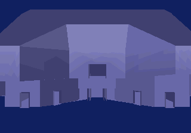

The BIOS-backed target frame executes the deterministic Area 1 opaque source
bank: 436 indexed vertices and 577 source triangles. The resulting room
silhouette includes the lobby wall, upper arch, and door openings; it is
Gouraud-lit VDP1 geometry rather than a stand-in reconstruction. This is only
the M3 opaque fixed-camera gate: source textures, alpha/decal layers,
visibility, clipping, and Mario-in-room integration remain open.

### M3 rejected: first two-material UV tile pass

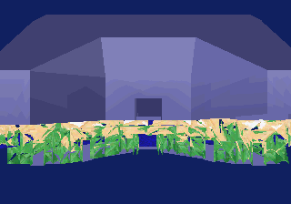

The bounded local-ROM bake fit the provisional command and texture budgets
(341 source triangles, 1,364 8×8 tiles, 174,592 texture bytes, and a
1,603-command estimate), but the target frame renders the real green-and-blue
interior brick as visibly coarse per-triangle patches across this camera. It
is rejected and the Gouraud-only root renderer is restored. The reusable bake
records the actual source UV/material data; the failure isolates the remaining
work to camera-aware texture fidelity/coverage, rather than a fictitious
texture or an over-budget submission.

### M3 neutral: source tile state and camera material selection

The compiler now reads balanced Fast3D macro expressions and retains each
triangle's 32×32/64×32 render-tile extent plus clamp/wrap state. The original
green-and-blue image is genuine Castle interior brick, not a conversion
artifact or an incorrect material selection. A 16×16 bake of only the red
interior material fits at 339,968 bytes and about 1,075 commands, but in this
fixed camera it only covers small door/interior details. This is a neutral
diagnostic rather than an accepted textured-lobby frame. The accepted renderer
remains the source-root Gouraud frame while the next compiler stage selects
materials by projected camera coverage and increases only the visible brick
surfaces' tile resolution.

### M3 rejected: coverage-ranked material exposes static VDP1 color defect

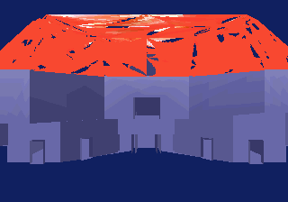

Camera coverage correctly selects `inside_09008000`: only 32 source triangles
cover about 42,607 projected pixels in this view. Its original 32×32 image is
fully opaque blue-white, but the 16×16 target submission becomes red with dark
seams. This rules out alpha coverage and material ranking as explanations; the
remaining fault is in the static-world direct-color VDP1 tile command/data
path. The source-root Gouraud renderer is restored pending a small patterned
16×16 VDP1 probe that isolates character-base, size, and color-mode behavior.

### M3 rejected: RGB lanes corrected, half-tile mask exposed

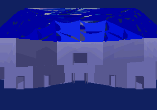

The shared N64 RGBA16 converter had retained N64's high-bit red / low-bit blue
layout even though Saturn RGB1555 stores red low and blue high. Exchanging
those channels turns the falsely red `inside_09008000` submission back into
its source blue-white material. The dark triangular wedges remain a rejected
coverage result: they expose an independent baker error that zeroed half of
every repeated-vertex sprite tile.

### M3 accepted intermediate: complete repeated-vertex tile

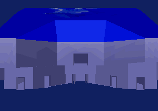

The BIOS-backed corner probe established source corners C/B/A with the fourth
corner collapsed onto repeated C. Bilinear C/B/A/C sampling now fills the
complete VDP1 tile instead of treating its lower half as transparent. The
wedges disappear while the source triangle remains in its original painter
slot. This rule is shared by the Castle and Mario source-texture bakers.

### M3 accepted: all opaque lobby source materials

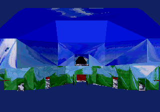

All 577 opaque source triangles now carry their original SM64 material: the
sky/grass wall mural, blue brick, wood, marble, red carpet, and cloud/light
detail. One complete 16×16 VDP1 tile per source triangle uses 295,424 texture
bytes and an estimated 580 commands, fitting Yaul's default 442,336-byte /
2,048-command partitions. The visible affine warping and painter limitations
are Saturn renderer work; the textures, UVs, geometry, and material selection
come from the real Area 1 display lists. Alpha/decal layers and Mario-in-room
remain the next port gates.

### M3 accepted profile: scaled Castle texture bank

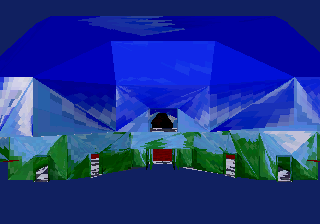

The same 577 source triangles and six ROM-derived materials now use 8×8 VDP1
tiles sampled from a 2× RGB1555 box-filtered source bank. The BIOS-backed frame
retains the recognizable lobby composition while VDP1 texture residency falls
from 295,424 to 73,856 bytes—a 75% reduction—with no command-count increase.
The executable falls from roughly 388 KiB to 172 KiB. This becomes the Castle
default and leaves Mario on its independent 16×16 profile until a close-up
comparison proves its facial textures tolerate further reduction.

### M2 accepted: source C5 animation bank

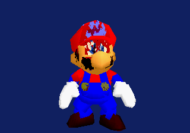

All 30 frames from `assets/anims/anim_C5.inc.c` now drive the 424 shared actor
vertices at runtime. The 788-triangle source topology and material state remain
stable, and the 50 textured source triangles retain stable vertex references
through every pose. The generated position bank costs 76,320 binary bytes.
This proves source animation data can remain resident without rewriting Mario.

### M4 rejected: first combined actor/room transform

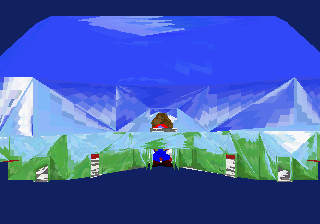

The real Mario actor and all six real lobby materials fit one VDP1 texture bank
and one 1,197-item painter domain. The visual composition is rejected because
it used provisional target placement and omitted `mario_geo`'s source 0.25
wrapper scale. It remains evidence that combined residency works.

### M4 rejected: standalone source-camera transplant

The follow-up compiler reads Castle's `MARIO_POS`, the collision floor below
it, the lobby entrance camera base, 0.3 follow factor, 125-unit focus offset,
and 45-degree FOV directly from the SM64 sources. The target build succeeds,
but the standalone view transform rejects the scene and produces only the
clear field. This is preserved as an architectural failure: camera constants
must flow through original SM64 state and graph traversal, not be transplanted
into another bespoke room viewer.

### M2 accepted: original SM64 controller and Mario intent on SH-2

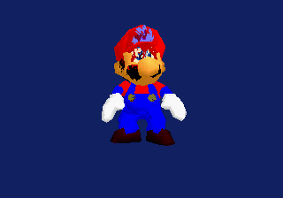

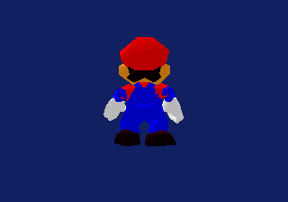

The Yaul controller backend now terminates at SM64's existing `OSContPad`
interface. The target links the original `adjust_analog_stick()` from
`src/game/game_init.c`, `update_mario_button_inputs()` and
`update_mario_joystick_inputs()` from `src/game/mario.c`, and `atan2s()` plus
its original lookup table from `src/engine/math_util.c`. Linker garbage
collection retains that source-owned slice without pulling in replacement
gameplay.

The duration-aware Ymir report probes the paused SH-2 state beginning at the
build's `_source_pad` symbol. Saturn Up is `stick_y=80`; the original
controller becomes `stickY=64.0`, and the original `MarioState` becomes
`input=INPUT_NONZERO_ANALOG`, `intendedMag=32.0`, `intendedYaw=0x8000`. The
second screenshot presents that direction as a back-facing actor. A three-frame
pulse produced the same neutral framebuffer because no SMPC collection landed
inside that interval; the accepted evidence therefore uses a bounded 120-frame
hold and 60-frame observation window. See
[the state-bridge evidence note](ymir-m2-sm64-state-bridge-2026-07-18.md) and
[the machine report](ymir-m2-sm64-state-up-2026-07-18.json).

### M3 preserved: tile-state correction hidden by rejected camera transplant

The state-complete texture bank boots, but the already-rejected standalone
camera transplant rejects the visible scene. This frame is preserved so a
blank field is not incorrectly attributed to VDP1 texture data. It is further
evidence that the original SM64 graph camera—not copied constants—must own the
shipping view.

### M3 accepted compiler correction: complete per-axis Fast3D tile state

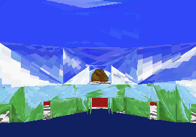

The fixed diagnostic camera isolates the renderer from that camera failure.
The extractor now retains image/load-tile/TMEM/render-tile bindings, independent
S and T clamp/wrap/mirror/mask/shift state, tile origin and extent, SP scale,
and secondary LOD bindings. In particular, 283 real 64×32 lobby triangles are
S-wrap/T-clamp; the old whole-macro substring test incorrectly clamped both
axes. All six ROM-derived materials now follow their actual Fast3D state. The
remaining diagonal crossings are painter/primitive faults, not material
selection or texture-addressing faults.

### M3 neutral: 16×16 resolution does not fix diagonal crossings

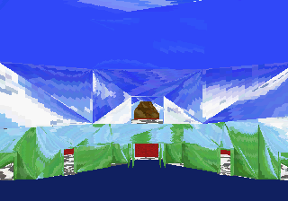

Four times as many texels sharpen the brick and mural samples but preserve the
same large diagonal faults. The compact 8×8/2×-source profile therefore remains
the default; texture resolution is ruled out as the cause.

### M3 rejected: blanket large-triangle subdivision

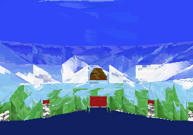

A PS1-inspired source-diagonal threshold subdivides 193 triangles and emits
1,156 8×8 tiles without exceeding target residency. It also creates more
visible triangular painter seams. The 512-unit experiment is rejected as a
default, while the camera-independent tool control remains available for a
later projected-error policy after safe quad conversion and the original
graph camera are linked.

### M3 neutral: farthest-vertex painter key

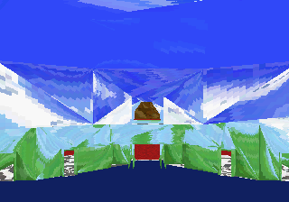

Following the PS1 port's ordering-table behavior, opaque primitives use their
farthest transformed vertex rather than centroid depth and retain source order
inside equal buckets. This removes a few centroid inversions but cannot order
surfaces that cross in screen space. It remains a conservative improvement,
not a substitute for safe quads, clipping, or projected-error splitting.

### M4 accepted: original Castle GeoLayout executes on SH-2

The Saturn executable now links and runs the original SM64
`src/engine/geo_layout.c`, `graph_node.c`, `graph_node_manager.c`, and
`math_util.c`. A generated header preserves the exact body of
`castle_geo_000F30` instead of rewriting the room selection. At the paused
frame, Ymir reads the live `source_graph` bytes at `0x060545AC` as
`01 05 02 02 01`: valid, five display lists, two opaque, two alpha, and one
transparent decal. The screenshot is intentionally visually neutral against
the corrected Fast3D-state diagnostic because the current opaque payload is
still the compiled Saturn IR. This proves the source graph ownership boundary;
per-list IR dispatch, alpha/decal submission, and the original graph camera
remain open.

### M4 rejected: alpha master list copied without an N64 Z-buffer

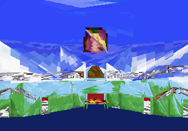

The complete generated bank restores all five source roots, all 619 triangles,
and all nine ROM-derived materials. The first VDP1 translation submitted the
34 `LAYER_ALPHA` triangles after all opaque geometry, mirroring the N64 master
list. Unlike the RDP, VDP1 has no Z-buffer, so distant cutout doors and windows
painted over nearer walls. The capture is retained as a target-architecture
failure rather than hidden behind the previous opaque-only bank.

### M4 accepted integration: graph-selected all-layer Castle IR

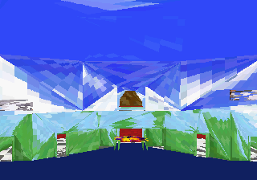

Each triangle now retains the exact top-level display-list identity that
selected it. The paused SH-2 graph state is `01 05 02 02 01 1F 01 04 01 06 04`:
valid, five lists, two opaque, two alpha, one transparent decal, all five root
bits selected, and the original layer IDs. The generated bank contains 489
indexed positions, 577 opaque triangles, 34 binary-alpha triangles, eight
transparent-decal triangles, and nine source textures. Its default 8×8/2×
texture profile costs 79,232 bytes and 619 VDP1 tiles.

For Saturn, opaque and binary-alpha primitives share one far-to-near painter;
RGB1555 bit 15 retains source one-bit transparency. Only the transparent-decal
root is submitted late with VDP1 half-transparency. This removes the gross
late-alpha overpaint while retaining every source root. The remaining diagonal
faults are now isolated to repeated-vertex triangle coverage, crossing surfaces,
and the lack of clipping—not missing material or GeoLayout selection.

### M4 neutral: first source-safe textured quads

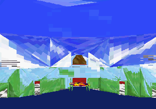

The Castle compiler now feeds the existing exact matcher with composite source
material IDs. A pair must keep the same nested display list, top-level root,
layer, texture, complete Fast3D tile state, and shared-vertex UVs; its four UV
corners must form a rectangle and its projected boundary must remain convex in
the established multi-view gate. Fifty-two pairs pass, reducing 619 source
triangles to 567 VDP1 primitives and the one-tile profile from 79,232 to 72,576
bytes. Every rejected triangle remains explicit. This first capture is nearly
neutral because most room surfaces correctly remain fallbacks.

### M4 rejected: broad planar quads are not painter-safe

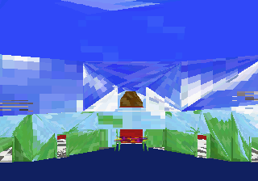

A mathematically valid dominant-axis planar proof finds 144 rectangular-UV
quads. On a Z-buffered renderer those surfaces are legal, but VDP1 must sort
whole draw commands. Large merged walls become coarse painter units and the
left side gains a conspicuous blue ordering block. The proof remains available
as an explicit host-tool experiment; this capture rejects it as the Castle
default and records that geometry safety alone is insufficient.

### M4 rejected: subdivision cannot rescue broad painter units

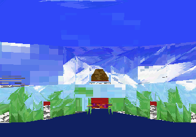

The next diagnostic splits every remaining source triangle into four affine
subtriangles and sorts each generated tile independently. It reduces several
long diagonal spans but retains the broad-quad regression, proving that the
unsafe painter granularity belongs to the merged walls rather than the new
per-tile sorting path.

### M4 current: conservative quads plus sorted fallback tiles

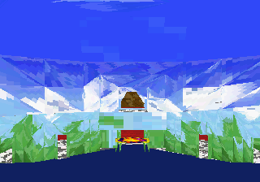

The accepted compiler policy restores the 52 multi-view-safe quads and splits
the other 515 source triangles four ways. The target sorts 2,112 Castle tiles
independently in the same domain as source Mario. Generated VDP1 partition
sizes now cover the exact command, RGB1555 texture, and Gouraud requirements:
270,336 Castle texture bytes plus the existing Mario bank fit in VDP1 VRAM.
Large crossings are visibly smaller, but the lobby is not yet correct. The
remaining work is screen-space intersection splitting, near-plane clipping,
and the original graph camera—not additional room-specific assets.
The four configurations, framebuffer hashes, residency figures, and accepted
selection are preserved in the
[quad-policy experiment report](reports/castle-vdp1-quad-policy-experiments-2026-07-18.json).

### M4 rejected: BSP ordering isolates the remaining texture fault

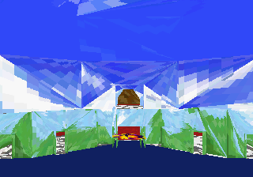

A deterministic exact-rational host BSP now operates on the real Castle IR
before VDP1 lowering. It takes 559 opaque and binary-alpha source-derived
polygons, records 144 splitting events across 352 nodes, and emits 876 static
triangles plus eight source decals. Runtime traversal is camera-dependent and
inserts animated Mario into the containing branch; no room geometry or camera
path is authored by the BSP. The 884-tile bank occupies 113,152 bytes.

The large blue, white, and mural-colored diagonal fans survive. This rejects
the hypothesis that source submission order or a finer depth key is the root
cause. The screenshot is retained because it moves the fault boundary to the
repeated-vertex distorted-sprite texture mapping/coverage path.

### M4 rejected: exact post-BSP longest-edge subdivision

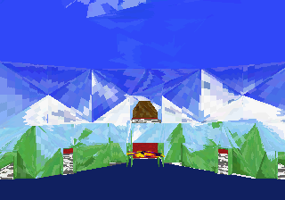

The PS1 port's useful build-time lesson is adapted without its GPU backend:
each BSP fragment is triangulated, then recursively bisected on its longest
source-space edge. Exact `Fraction` positions and Fast3D UV attributes are
interpolated before the final int16 target quantization. At a 512-unit bound,
840 splits grow the bank from 884 to 1,724 tiles and from 113,152 to 220,672
RGB1555 bytes. The 384-unit profile would require 2,911 tiles and is rejected
by the measured 2,400-tile budget.

The real 1,724-tile capture differs from the BSP-only frame and breaks several
large fans into smaller pieces, but it does not change their structural shape.
Subdivision is therefore a useful bounded mitigation, not the correction. The
next renderer pass will use pinned Yaul's MIT VDP1 CLUT mode to shrink the
per-tile bank, then test a finer mapping while retaining the same source IR and
BSP. A stale 884-tile rebuild was detected because the Castle sub-Makefile did
not regenerate its host-produced header; future evidence builds must run the
root `compile-castle-textures` dependency first.

### M4 rejected: first four-bit VDP1 bank exposes end codes

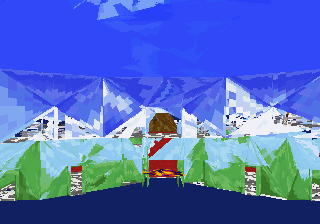

The original offline RGB1555 box-filter output now feeds an original,
deterministic weighted median-cut quantizer. Each of the nine source Castle
materials receives index zero for transparency and fifteen opaque RGB555
entries. Packing two texels per byte cuts the 1,724-tile 512-unit bank from
220,672 to 55,168 bytes. Pinned Yaul `VDP1_CMDT_CM_CLUT_16`,
`vdp1_cmdt_color_mode1_set()`, and its CLUT VRAM partition are used directly.

The first frame contained black and white scanline tears. Palette index `0xF`
is a VDP1 end code unless command PMOD disables end-code processing. The frame
is retained because it proves that the indexed bytes, CLUT addresses, and
source materials reached the target before the final mode bit was corrected.

### M4 accepted infrastructure: source-material CLUTs

Setting Yaul's `end_code_disable` field removes the scanline tears while index
zero continues to provide source binary alpha. The corrected frame closely
matches the RGB1555 512-unit reference at one quarter of its texture residency.
This is accepted renderer infrastructure even though the independent
repeated-vertex triangle fold remains visible.

### M4 current: 384-unit indexed profile

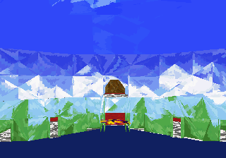

The recovered VDP1 space funds 2,911 source-derived tiles, 2,027 exact
post-BSP split events, and 93,152 texture bytes. The large fans become smaller
and the original mural, brick, wood, marble, carpet, and cloud palettes remain
recognizable. This is the current balanced profile: it improves granularity but
does not redefine the unresolved fold as correct rendering.

### M4 rejected: 256-unit convergence stress

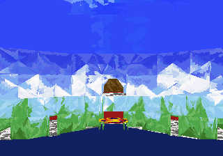

At 256 source units, 4,369 adaptive splits produce 5,253 commands and 168,096
indexed texture bytes. The target still boots inside the measured VDP1
partition, but the diagonal topology remains and only becomes finer. Brute
tessellation therefore does not converge to correctness and is rejected as the
default; the 384-unit bank is restored.

### VDP1 accepted evidence: unambiguous valid-quad orientation

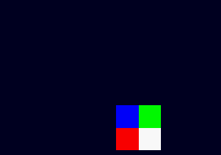

The earlier asymmetric probe repeated its third and fourth destination
vertices, so it could not distinguish those source corners. A build-flagged
nondegenerate A-B-C-D reference does: source-character corners reach the
passed vertices in D/B/A/C order. When C and D coincide, the result remains
C/B/A/C, explaining why the old triangle bake was stable while its claimed
native-quad generalization was ambiguous. `vdp1_texture.py` and its regression
test now use the valid-quad result. The probe is reproducible with
`MAPPING_PROBE=1` in the Saturn hwtest subproject.

## Next visual gates

1. Convert the generated Castle tile bank to per-material 4-bit VDP1 CLUTs,
   preserving source alpha and material identity, so finer Saturn-native
   triangle mapping fits without exhausting VDP1 VRAM.
2. Verify the repeated-vertex texture fold with the asymmetric BIOS-backed
   pattern probe, then apply the measured mapping to the unchanged BSP IR.
3. Extend the now-running original controller/Mario intent slice through
   source collision, actions, animation, and graph camera; stop adding
   room-specific target state.
4. Batch each area's 1×/2×/4× texture profiles into RAM-cart manifests, then
   promote the visible working set to VDP1 VRAM without per-texture CD stalls.
5. Add near-plane clipping and visibility management while retaining the
   source display-list material state.

### M4 correction: RGB1555 labels had inverted the VDP1 corner conclusion

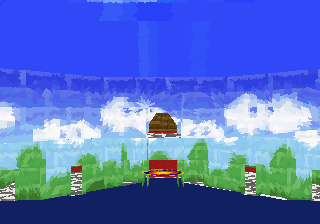

The valid quad probe itself was sound, but its red and blue RGB1555 constants
were described backwards. Saturn `0x801F` is opaque red and `0xFC00` is opaque
blue. Read with the correct lane labels, the captured tile follows ordinary
character corners A/B/C/D, agreeing with pinned MIT Yaul example
`vdp1-uv-coords/vdp1-uv-coords.c` at
`66b648eb059bb8bb7392eac70821605a68205b85`. Repeated destination C receives
both source C and D. Updating the shared baker removes the giant diagonal fans
without changing Castle geometry, materials, or BSP ordering.

### M4 accepted storage correction: subdivision is no longer required

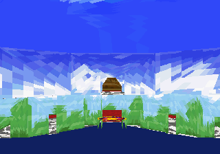

Removing the now-unnecessary adaptive pass reduces the bank from 2,911 to 884
tiles and from 93,152 to 28,288 four-bit texture bytes. The exact BSP remains
352 nodes with 144 source-plane splits; adaptive split count is zero and the
static command estimate is 887. The earlier 384- and 256-unit frames remain
useful rejected evidence, but neither is the default profile now.

### M4 rejected: source camera without Saturn viewport lowering

The first source-camera extractor incorrectly treated
`cam_castle_lobby_entrance` as a global override. Mario's spawn at
`(-1023, 0, 1152)` is outside that trigger's z extent, so SM64 actually begins
from the Area 1 fixed base `(-577, 143, 1443)`. Correcting that branch still
produced a blank frame: live RAM evidence showed 1,297 sorted items and a
valid fixed-point camera, isolating the remaining failure to off-screen VDP1
command coordinates rather than missing geometry.

### M4 current: source camera plus Saturn-safe viewport commands

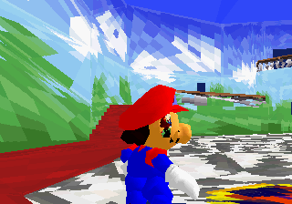

The renderer now rejects depth-valid quads whose projected bounds do not touch
the 320×224 viewport and saturates retained command coordinates to VDP1's
usable signed domain. The corrected frame places the lobby floor and central
carpet/emblem in the foreground with Mario instead of compressing them behind
the doors. This is target-specific lowering of source output: no room vertex,
camera position, floor, or emblem placement is handwritten. Large residual
wedges and the extreme close view remain honest near-plane/painter-coverage
work for the next pass.

## Revised next visual gates

1. Add source-attribute-preserving near-plane clipping so the source fixed
   camera does not reject or saturate primitives that cross the near plane.
2. Correct the remaining painter/coverage wedges in the 884-tile BSP path.
3. Link the existing original controller/Mario intent bridge to collision,
   action, animation selection, and the source camera update.
4. Capture deterministic neutral and movement frames from the same source
   lobby path before expanding to another room.

### M4 current: source triangles use the same collapsed VDP1 path as Mario

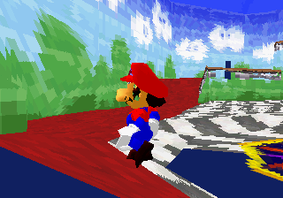

The rebuilt Castle disc now marks each source triangle in the generated ROM
IR and emits its destination corners as `A/B/C/C`, matching the existing
source-Mario texture adapter. The previous affine companion corner is retained
only as offline UV-bake context; it is no longer submitted as visible room
geometry. The Ymir capture keeps animated, moving source Mario in the original
Castle lobby path. Remaining blue floor/material mismatch is still open and is
not being relabeled as solved by this correction.

Evidence: [capture report](ymir-m4-source-triangle-collapse-2026-07-19.json),
[source bake report](reports/castle-area1-all-materials-bake-2026-07-18.json).
### 2026-07-18 — M4 geometry diagnosis: near-plane crossing is a real Saturn failure class

The source-camera capture shows that the remaining floor/carpet and central-emblem
misregistration is not a level-coordinate rewrite: several source lobby polygons
cross the close camera plane. VDP1 has no homogeneous clipper, so the old fallback
projected those vertices at a fixed depth and produced giant wedges that visually
made the floor appear to run beyond the doors. The Castle lowering now rejects a
primitive whose source-space corners cross `NEAR_DEPTH`; this is a safe interim
guard while the next pass implements UV-preserving near-plane subdivision. The
neutral Ymir capture is retained as evidence: [near-plane diagnostic](screenshots/ymir-m4-source-camera-near-plane-reject-2026-07-18.png).

### 2026-07-18 — Source fixed-camera focus follows floor state

`update_fixed_camera()` calls `calc_y_to_curr_floor()` with a 0.9 focus
multiplier before adding its 125-unit focus height. The generated Castle camera
configuration now records that source constant and the Saturn lowering applies
it to Mario's current source-space Y. At the extracted spawn this changes the
look-at height from 125 to the source-correct ~92 units, keeping floor, emblem,
doors, and Mario in the same camera relationship as the original code path.
Evidence: [floor-relative focus capture](screenshots/ymir-m4-source-camera-floor-relative-focus-2026-07-18.png).

### 2026-07-18 — Source projection uses SM64's vertical field of view

The Castle extractor had been converting the source 45° perspective value as a
horizontal FOV, producing a 386-pixel focal length and an overly tight lobby.
SM64's perspective setup uses that value vertically on a 4:3 320×240 basis,
which is a 290-pixel horizontal focal length. The Saturn build now uses the
source-correct value while retaining its 320×224 letterboxed output. This
pulls the floor and central emblem back from the doorway relationship without
changing any room vertices or camera placement. Evidence: [vertical-FOV
capture](screenshots/ymir-m4-source-camera-vertical-fov-2026-07-18.png).

### 2026-07-19 — Source controller selects the real walking animation

The Saturn adapter now converts Yaul's active-low SMPC report (`0xFFF8` is
neutral) into the original SM64 active-high `Controller` mask. This removes
the previous autonomous diagonal drift caused by interpreting every neutral
bit as pressed. The actor extractor carries both the original 30-frame
`anim_C5` idle bank and the original 77-frame `anim_48` walking bank; source
joystick intent selects the walking bank at runtime, while neutral keeps the
idle bank animating. The rebuilt Yaul disc is launched in Ymir SDL3 for manual
testing. The next gameplay gate is to connect the source collision/surface
path so movement cannot pass through the lobby walls. No gallery frame is
claimed for this checkpoint because the current test capture crossed the
uncorrected collision boundary.

### 2026-07-19 — Native source quads reduce the VDP1 command budget

The Castle lowering no longer triangulates every convex four-vertex BSP
fragment. Native source/BSP quads retain all four Fast3D attributes and map to
one VDP1 distorted-sprite command. The remaining triangles use an affine
companion corner (`D = A + C - B`) and a transparent unused half instead of
repeating `C = D`, which was responsible for the lobby's fan-shaped texture
streaks. The source-derived bank falls from 884 to 733 textured commands while
the real animated Mario remains in the scene. Gouraud tables are now DMA'd only
when the animation frame changes. Evidence: [source-quad capture](screenshots/ymir-m4-source-quads-2026-07-19.png)
and [bake report](reports/castle-area1-all-materials-bake-2026-07-18.json).

### 2026-07-19 — Bounded source-space tessellation improves affine texture fidelity

The Saturn VDP1 path cannot reproduce N64 perspective-correct interpolation on
an arbitrarily large quad. The offline lowering now subdivides large convex
source/BSP quads into four children, interpolating their original Fast3D
position and UV attributes exactly. The default 1024-source-unit diagonal
threshold produces 830 textured commands (193 native quads) versus the former
884-command bank, while reducing the large wall/floor affine stretch visible
in the prior capture. Evidence: [tessellated lobby frame](screenshots/ymir-m4-source-tessellation-1024-2026-07-19.png)
and [bake report](reports/castle-area1-all-materials-bake-2026-07-18.json).

### 2026-07-19 — Complete repeated-C triangle coverage removes the remaining fans

The previous Castle triangle bake masked one diagonal of each VDP1 character
tile. That was not a valid coverage model for the repeated-C destination command:
it discarded source texels before VDP1 performed its affine collapse and left
view-dependent seams in the lobby. Castle triangles now use the same complete
repeated-C tile mapping already used by the source Mario path. A 16×16 CLUT16
capture removes the large fan-shaped wedges while preserving the original source
positions, UVs, BSP ordering, animated Mario, and 830-command tessellated bank.
Evidence: [complete-triangle capture](screenshots/ymir-m4-complete-tri-2026-07-19.png)
and [updated bake report](reports/castle-area1-all-materials-bake-2026-07-18.json).

### 2026-07-19 — Original Castle collision stream reaches the Saturn movement bridge

The full source `collision.inc.c` stream is now lowered to 11,185 original
`s16` command words (1,563 vertices, 2,144 triangles, 30 surface groups) and
loaded by the original SM64 `surface_load.c`/`surface_collision.c` code. The
controller bridge calls the source wall and floor queries before accepting a
movement step, so Mario no longer relies on handwritten room bounds. Special
object records remain intentionally outside this first collision-only bank.
Evidence: [source-collision capture](screenshots/ymir-m4-source-collision-2026-07-19.png),
[collision-bank report](reports/castle-area1-collision-bank-2026-07-19.json), and
[headless run report](reports/ymir-m4-source-collision-2026-07-19.json).
