# Saturn port visual timeline

This is the visual portfolio for the port. Each entry distinguishes a
boot/protocol diagnostic from an actual renderer result, and distinguishes
source-derived content from an original stand-in. Screenshots are evidence of
the named state only; emulator timing is not retail hardware evidence.

For a screenshot-first viewer, open [the visual timeline gallery](index.html).

| Stage | What it proves | Visual evidence |
|---|---|---|
| Hello disc | The first Yaul SH-2 disc reached a display through Yabause HLE. | [hello screen](screenshots/2026-07-17/hello-yabause-hle.png) |
| Hardware-test geometry | VDP1 can draw the test primitives, including textured/repeated-vertex triangles. | [textured triangle](screenshots/2026-07-17/hwtest-kronos-textured-triangle.png), [repeat-vertex triangle](screenshots/2026-07-17/hwtest-kronos-textured-triangle-repeat.png) |
| Hardware-test gate | Unsupported cartridge configurations fail visibly. | [size gate](screenshots/2026-07-17/hwtest-kronos-size-gate.png) |
| Ymir controller automation | The agent debugger selected English and advanced through the USA BIOS UI. | [English selection](screenshots/ymir-input-pulse-right-2026-07-17.png), [confirmation](screenshots/ymir-input-pulse-a-2026-07-17.png) |
| BIOS-backed hwtest | The fixed Ymir headless path authenticated the disc, loaded A.BIN, and completed the VDP1 hwtest. | [hwtest frame](screenshots/ymir-bios-hwtest-2026-07-17.png), [raw/report](ymir-bios-hwtest-2026-07-17.md) |
| Mario intro-face stand-in | Original VDP1 material-region study: cap, skin, hair, eyes, moustache, mouth, and collar. It is **not** a render of the original SM64 Mario mesh. | [intro-face study](screenshots/ymir-introface-2026-07-17.png) |
| Mario source-face topology | The VDP1 renderer projected all 440 original vertices and submitted all 877 original `mario_Face_FaceData` triangles from `src/goddard/dynlists/dynlist_mario_face.c`, each with a Gouraud table. The colors remain temporary material-ID mapping; geometry is source-derived. | [source-face frame](screenshots/ymir-source-face-2026-07-17.png), [capture report](ymir-source-face-2026-07-17.json), [provenance](../INTROFACE_PROVENANCE.md) |
| Mario source-face materials | The mesh extractor converted the same file's eight original `SetAmbient` material colors to RGB555: teeth/emblem/eyes, skin, hat shadow, hair, mouth, and cap. VDP1 uses them as Gouraud endpoints. | [source-material frame](screenshots/ymir-source-material-face-2026-07-17.png), [capture report](ymir-source-material-face-2026-07-17.json), [provenance](../INTROFACE_PROVENANCE.md) |
| Mario source eyes and pupils | The static front-pose renderer adds both original 48-vertex / 82-triangle eye objects from `dynlists_mario_eyes.c`, including blue irises, black pupils, and white highlights. | [source-eye frame](screenshots/ymir-source-eyes-face-2026-07-17.png), [capture report](ymir-source-eyes-face-2026-07-17.json), [provenance](../INTROFACE_PROVENANCE.md) |
| Mario eye alignment calibration | The first static transform was retained, measured against the source face eye-surface bounds, then corrected by right `(+5,-4)` and left `(-6,-4)` screen pixels. | [initial eye frame](screenshots/ymir-source-eyes-face-2026-07-17.png), [calibrated eye frame](screenshots/ymir-source-eyes-calibrated-2026-07-17.png), [capture report](ymir-source-eyes-calibrated-2026-07-17.json) |
| Mario eye-size calibration | The separate source eye meshes were reduced to 2/3 around their matching source eye-surface centers so irises/pupils sit inside the white face geometry. | [scaled-eye frame](screenshots/ymir-source-eyes-scaled-2026-07-17.png), [capture report](ymir-source-eyes-scaled-2026-07-17.json) |
| Topology-derived Gouraud depth | Per-vertex normals are accumulated from the 877 source triangles and evaluated against an upper-left key light, producing continuous VDP1 Gouraud lighting on the face. | [Gouraud frame](screenshots/ymir-source-gouraud-2026-07-17.png), [capture report](ymir-source-gouraud-2026-07-17.json) |
| Rejected raw-feature placement | The first feature import drew every moustache triangle after the face, placing it over the nose and making its otherwise-correct source scale and black material read like an oversized cutout. Preserved as a failure, not accepted renderer progress. | [failure frame](screenshots/ymir-source-features-2026-07-17.png), [capture report](ymir-source-features-2026-07-17.json), [provenance](../INTROFACE_PROVENANCE.md) |
| Intermediate reduced moustache | A 3/4-scale dark-brown calibration proved that shared Z sorting fixes nose occlusion, but unnecessarily changed two source-authentic properties. Preserved as an intermediate correction. | [intermediate frame](screenshots/ymir-features-calibrated-2026-07-17.png), [capture report](ymir-features-calibrated-2026-07-17.json), [provenance](../INTROFACE_PROVENANCE.md) |
| Source-scale black moustache | The accepted correction restores the original scale, position, and black material while retaining the unified face/feature Z sort. The nose now occludes the full source silhouette correctly. | [accepted frame](screenshots/ymir-mustache-source-scale-2026-07-17.png), [capture report](ymir-mustache-source-scale-2026-07-17.json), [provenance](../INTROFACE_PROVENANCE.md) |
| Goddard-profiled shine | The exact 32x32 IA8 shine map was extracted from a hash-validated user-owned US ROM and measured without committing the asset. Its narrow lobe is close-ported as a fixed-point specular term in the existing VDP1 Gouraud endpoints. | [shine frame](screenshots/ymir-face-shine-2026-07-17.png), [capture report](ymir-face-shine-2026-07-17.json), [provenance](../INTROFACE_PROVENANCE.md) |
| Interactive face loop | The static proof now runs every VBlank with fixed-point yaw/pitch/zoom projection, camera-aware painter sorting, persistent VDP1 command storage, cached per-vertex lighting, an A-button shine switch, B-button auto-orbit, and a live timing/pad HUD. | [interactive frame](screenshots/ymir-interactive-face-2026-07-17.png), [capture report](ymir-interactive-face-2026-07-17.json), [provenance](../INTROFACE_PROVENANCE.md) |
| Renderer cost split | Source inspection of SlaveDriver, Jo Engine, and Sonic Z-Treme led to an explicit four-way HUD measurement: painter sort, transform/command build, conditional Gouraud upload, and render wait. The BIOS-backed Ymir capture shows the counters over the actual source-derived face; emulator timing remains comparative evidence only. | [telemetry frame](screenshots/ymir-renderer-telemetry-2026-07-17.png), [capture report](ymir-renderer-telemetry-2026-07-17.json), [prior-art decision](../RENDERER_PRIOR_ART.md) |
| Controller polling repair | The demo now initializes SMPC before registering the libyaul-style VBlank INTBACK callback and processes a sample every loop. A bounded Ymir Right hold reaches the Saturn program as `DOWN 8000` and changes the rendered framebuffer from the neutral baseline. | [neutral frame](screenshots/ymir-input-neutral-2026-07-18.png), [Right-held frame](screenshots/ymir-input-right-held-2026-07-18.png), [capture report](ymir-input-right-held-2026-07-18.json), [provenance](../INTROFACE_PROVENANCE.md) |
| Remote release follow-up | Preserved automation limitation: after Ymir removes its persistent pad override, the most recent Saturn-side sample remains latched as `DOWN 8000` in this run. Manual SDL input is ready for retest, but deterministic remote release is not yet claimed. | [latched-release frame](screenshots/ymir-input-right-2026-07-18.png), [capture report](ymir-input-right-2026-07-18.json) |
| Painter/vertex cache pass | The first performance pass retains the preceding frame's nearly sorted order, caches one depth per surface, and transforms/projects each of the 440 shared face vertices once per frame. This removes repeated fixed-point work without changing source topology or the Gouraud result. Manual SDL testing on 2026-07-18 changed the result from “incredibly slow” to “much much faster, much better,” accepting the interaction improvement while leaving retail-hardware timing unclaimed. The next measured risk is VDP1 command cost from 1,049 repeated-vertex triangle commands. | [optimized frame](screenshots/ymir-sort-cache-2026-07-18.png), [capture report](ymir-sort-cache-2026-07-18.json), [renderer decision](../RENDERER_PRIOR_ART.md) |
| Conservative true-quad compiler | A host-side Saturn render IR preserves all 877 SM64 source triangles but replaces 156 validated pairs with real VDP1 quads. Strict material, winding, normal, and 15-view projected-convexity gates leave 565 face triangles as explicit fallbacks. Total draw commands fall from 1,213 to 1,057 without changing the visible face silhouette, feature occlusion, eyes, or shine. | [quad frame](screenshots/ymir-true-quads-2026-07-18.png), [capture report](ymir-true-quads-2026-07-18.json), [pairing audit](reports/introface-quad-pairing.json), [provenance](../INTROFACE_PROVENANCE.md) |
| Exact blossom quad matching | Hash-pinned NetworkX 3.6.1 replaces the local pairing heuristic with exact maximum-cardinality, maximum-integer-quality matching. It proves that 156 is the maximum among 206 safe candidates and improves three pairing records without changing command count. The resulting capture changes only nose shading: 610 color pixels and zero foreground-mask pixels versus the heuristic build. | [exact frame](screenshots/ymir-exact-quads-2026-07-18.png), [capture report](ymir-exact-quads-2026-07-18.json), [pairing audit](reports/introface-quad-pairing.json), [provenance](../INTROFACE_PROVENANCE.md) |
| Reusable mesh IR v1 | The 440-vertex face now enters the same versioned compiler interface intended for animated actors. The audit artifact preserves 877 source triangle IDs, 41 ordered Goddard joints, and 506 unnormalized Q15 weight records before producing the same 721 VDP1 primitives. The BIOS-backed framebuffer hash is exactly identical to Stage 15, proving no neutral-render regression. | [IR regression frame](screenshots/ymir-mesh-ir-v1-2026-07-18.png), [capture report](ymir-mesh-ir-v1-2026-07-18.json), [compiled mesh IR](reports/introface-mesh-ir.json), [IR contract](../SATURN_MESH_IR.md) |
| Animated-disc boot timing | The first rebuilt-disc automation capture stopped at the Sega BIOS logo after 2,100 frames. Extending the same deterministic USA-BIOS macro to 3,300 frames reached the target, so this is preserved as a boot-timing diagnostic rather than a renderer result. | [boot-delay frame](screenshots/ymir-eyelid-animation-first-2026-07-18.png), [report](ymir-eyelid-animation-first-2026-07-18.json) |
| Rejected animated-quad frame | The first eyelid animation pass applied raw source eyelid streams to the weighted face while retaining every neutral-pose true quad. At a deterministic later phase, a deformed quad produced an incomplete face. Repeating the same 3,500-frame route produced the identical broken hash, so this is a renderer-safety failure rather than a capture race. | [failure frame](screenshots/ymir-eyelid-animation-later-phase-2026-07-18.png), [repeat report](ymir-eyelid-animation-later-phase-repeat-2026-07-18.json) |
| Animation-safe eyelid fallback | The compiler now forbids merging any source triangle that touches one of the 42 eyelid-weighted face vertices until a full pose-complete Goddard evaluator exists. This leaves 130 static true quads and emits 108 animated-region triangles as explicit VDP1 fallbacks; the same later phase again renders the complete source face. This is an initial source-stream deformation study, not yet a full Goddard joint-matrix implementation. | [accepted frame](screenshots/ymir-eyelid-animation-triangle-fallback-2026-07-18.png), [capture report](ymir-eyelid-animation-triangle-fallback-2026-07-18.json), [pairing audit](reports/introface-quad-pairing.json) |
| Rejected VDP2 title-layer probe | The first M1 NBG1 bitmap staging attempt was deliberately tested through three compositor variants. The final priority probe proves NBG1 is active but black in Ymir; it must not replace the working face scene yet. The face capture immediately before it also confirms the eye surface/pupil/glint ordering correction. This failure now requires a standalone minimal Yaul bitmap probe before reintegration. | [eye-order frame](screenshots/ymir-m1-vdp2-layer-correction-2026-07-18.png), [black-plane failure](screenshots/ymir-m1-vdp2-cache-resolved-2026-07-18.png), [capture report](ymir-m1-vdp2-cache-resolved-2026-07-18.json) |
| Accepted VDP2 title field | A standalone NBG1 probe isolated the missing VDP2 VRAM cycle-pattern allocation. Close-porting Yaul's NBG1 fetch-slot pattern for banks A0/A1 makes the RGB555 staging field visible behind the VDP1 Mario face in the integrated Ymir capture. This is an original temporary field; it is not a redistributed SM64 title asset. | [standalone probe](screenshots/ymir-vdp2probe-cycle-pattern-2026-07-18.png), [integrated frame](screenshots/ymir-m1-vdp2-cycle-resolved-2026-07-18.png), [capture report](ymir-m1-vdp2-cycle-resolved-2026-07-18.json) |
| M1 VDP2 prompt | The player-facing `PRESS START` prompt is rasterized into the proven NBG1 title bitmap, avoiding the still-instrumentation-only NBG3 debug font path. It is correctly behind VDP1 Mario, so the face occludes its center; a Start edge replaces it with `STARTED`. | [accepted title frame](screenshots/ymir-m1-press-start-accepted-2026-07-18.png), [capture report](ymir-m1-press-start-accepted-2026-07-18.json) |
| Original title glyphs | The title prompt now uses locally generated N64 source HUD glyph pixels, converted from the user-owned US ROM into Saturn RGB1555 at build time. The derived header and ROM hash manifest stay uncommitted under `build/`; only the converter and evidence are tracked. | [source-glyph frame](screenshots/ymir-m1-source-press-start-2026-07-18.png), [capture report](ymir-m1-source-press-start-2026-07-18.json), [provenance](../INTROFACE_PROVENANCE.md) |
| Corrected source prompt + eyelid ordering | The first source-glyph pass read MIO0-compressed Segment 2 bytes directly and produced a noisy strip. The local converter now decompresses Segment 2 as the project extractor does, restoring the colorful original HUD glyphs. Strongly weighted upper-face primitives are also composed ahead of the independent eye meshes, making the eyelid contour visible over the eyes. | [accepted frame](screenshots/ymir-m1-source-glyphs-eyelid-occlusion-2026-07-18.png), [capture report](ymir-m1-source-glyphs-eyelid-occlusion-2026-07-18.json), [provenance](../INTROFACE_PROVENANCE.md) |
| Source-derived eyelid joint pose | The target now evaluates the same Goddard rest-joint inverse/current-joint transform used by `reset_weight()` / `move_skin()`: original eyelid pivots, static net yaw, `GD_ANIM_ROT3S` keyframes, and Q15 influences drive the original face vertices. The high-pose capture visibly closes the upper face over the independent source eye objects; it is not a screen-space lid substitute. | [neutral-pose frame](screenshots/ymir-m1-source-eyelid-joint-2026-07-18.png), [high-pose frame](screenshots/ymir-m1-source-eyelid-joint-highpose-2026-07-18.png), [high-pose report](ymir-m1-source-eyelid-joint-highpose-2026-07-18.json), [provenance](../INTROFACE_PROVENANCE.md) |
| Open-pose pupil composition | The first joint pose proof established that the real eyelid mesh moves, but pupils could still sort behind its independent eye/face surfaces. Pupil triangles now receive foreground priority only while the source eyelid rotation is within an open-pose threshold; a closed source lid remains free to occlude them. | [open-pose frame](screenshots/ymir-m1-source-eyelid-pupil-open-2026-07-18.png), [capture report](ymir-m1-source-eyelid-pupil-open-2026-07-18.json) |

## Source-face gallery

### Material conversion

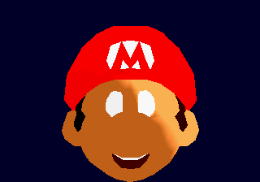

### Eye placement iteration

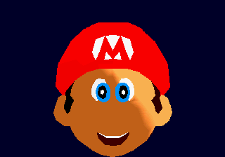

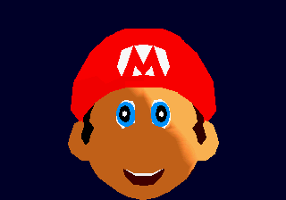

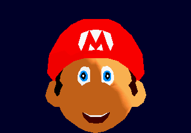

### Topology-derived Gouraud lighting

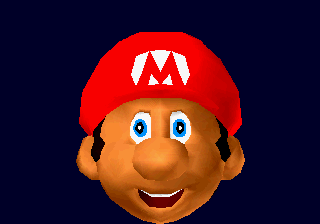

### Rejected: raw moustache and eyebrow placement

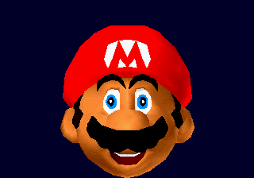

The source objects are valid, but this direct projection is not. The moustache
must follow its Goddard net/skin transform and correct depth/material behavior.

### Corrected static feature calibration

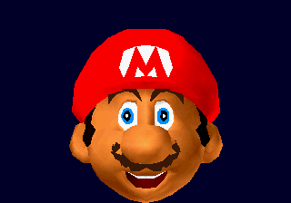

### Accepted source-scale black moustache

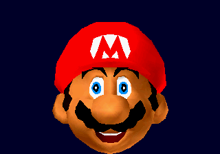

### Goddard-profiled VDP1 shine

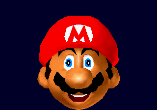

### Interactive camera and lighting benchmark

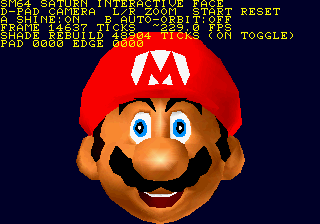

### Reusable mesh IR regression

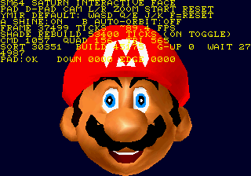

### Rejected: neutral-pose quads during eyelid deformation

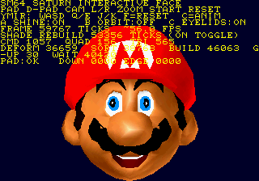

### Accepted: animated eyelid region as triangle fallbacks

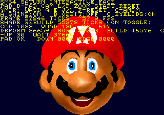

### Rejected: first VDP2 title-layer integration

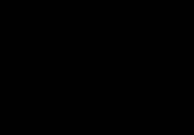

This is preserved rather than presented as a title backdrop. A standalone Yaul
NBG1 bitmap probe is now the gate before bringing the backdrop back into the
interactive face scene.

### Accepted: VDP2 title field under the VDP1 Mario face

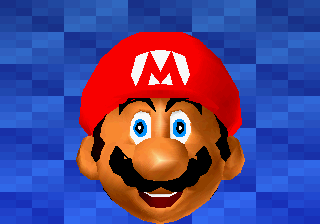

The field is an original diagnostic backdrop. The missing cycle-pattern fetch
slots were adapted from Yaul's permissive `vdp2-normal-bitmap` example; a
local, non-redistributed SM64 source asset conversion remains the next step.

### M1: VDP2-native PRESS START

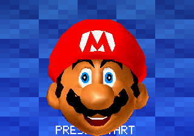

The prompt deliberately shares the title field and is therefore occluded by
Mario where they overlap. START changes the prompt bitmap to `STARTED`; the
deterministic input-duration/handoff proof is still outstanding.

### M1: original local source glyphs

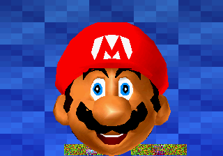

The colorful glyphs are converted locally from the user-owned US ROM and are
not part of the repository. The tracked converter preserves the reproducible
source-to-Saturn route without redistributing Nintendo art.

### Corrected original glyph decoding and eyelid foreground

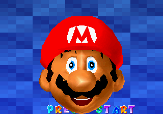

The prior glyph result read compressed Segment 2 bytes as pixels. The current
route decompresses first, and the eyelid face primitives now compose ahead of
the independent eye objects.

### Actual source eyelid joint pose

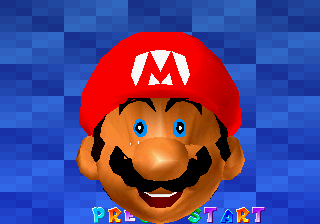

This replaces the earlier vertical-offset study. The face vertices are moved
through the source rest-joint inverse/current-joint transform and blended by
the original Q15 skin weights; no screen-space eyelid geometry is used.

### Open-pose pupil occlusion correction

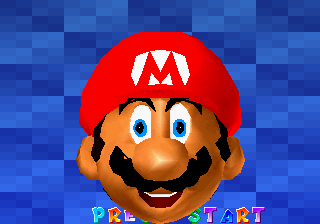

Pupil triangles are foreground only while the actual source eyelid is open.
The threshold is deliberately not applied to closed poses, where the animated
source skin must remain the occluder.

### Closed-pose pupil occlusion correction

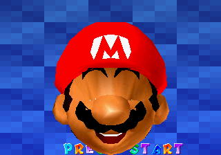

The capture-only build locks both original eyelid tracks to source frame 699,
where their roll values are maximally separated from rest. The complete eye
objects are submitted behind the deformed lid at this pose, so neither pupil
nor white leaks through. Normal builds retain the moving source animation;
the deterministic lock exists only to make this boundary reproducible.

### M2 rejected: initial in-game actor assembly

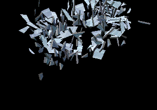

This is the first runtime capture of the normal in-game Mario actor stream:
788 triangles directly extracted from actors/mario/model.inc.c and the
mario_geo_body branch. It is deliberately preserved as a failure. The
translation-only staging evaluator is not yet equivalent to the source
GeoLayout transform stack, so the body is exploded rather than presented as
a Mario silhouette.

### M2 rejected: wrong actor-basis projection

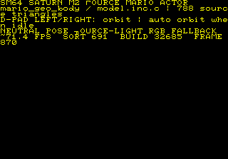

The fast source-order path presents correctly, but this capture proves that
the attempted X-up camera conversion projects the actor offscreen. The next
implementation gate is a source GeoLayout evaluator, not further camera
calibration guesses.

### M2 accepted plumbing: unmasked source Mario actor

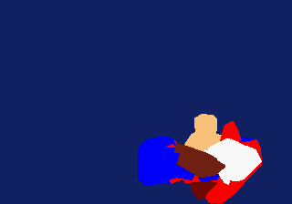

This capture is 788 triangles directly generated from the project’s
`actors/mario/model.inc.c`, selected by the evaluated `mario_geo_body`
GeoLayout branch, then submitted to VDP1. It proves the in-game source actor
reaches the Saturn display path. The fractured silhouette is expected: each
source triangle is still a repeated-vertex temporary VDP1 quad, so it is not
yet a quality, animation-safe presentation. The preceding VDP1 command probe
and depth-bucket captures are retained as rejected diagnostic evidence.

### M2 accepted: native-basis standing Mario IR

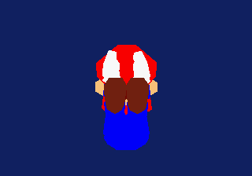

The actor now evaluates its native `mario_geo_body` basis correctly: source X
is screen-up, source Z is horizontal, and source Y is view depth. Its 788
source triangles compile into 183 accepted true VDP1 quads and 422 explicit
triangle fallbacks. This is an upright source actor geometry proof; it still
uses the temporary source-light RGB fallback, before texture conversion and
Gouraud lighting.

### M2 accepted: native VDP1 Gouraud actor lighting

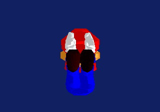

The same upright source actor now uses one VDP1 Gouraud table per compiled
primitive. Tables are built from accumulated source-mesh vertex normals and
uploaded through Yaul's SCU DMA path; the command mode explicitly selects
`VDP1_CMDT_CC_GOURAUD`. This is visible target lighting, not a flat-material
stand-in. Original Fast3D texture state remains the next fidelity gate.

### M2 rejected: first original texture submissions

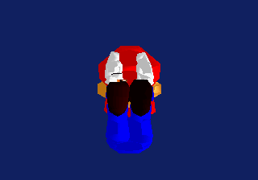

The first local-ROM texture converter initially read Mario's MIO0-compressed
segment as pixels; decoding the segment corrected those words. The following
VDP1 distorted-sprite pass still masks the actor because it maps a rectangular
texture over a non-rectangular Fast3D eye patch. Both captures are retained:
the assets are now correct, while the renderer still needs per-primitive UV
tessellation rather than an overlay approximation.

### M2 rejected: UV tiles submitted after the actor

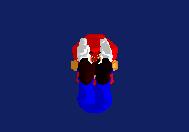

All 11 original `mario_eyes_cap_on_dl` position/UV triplets now bake into
transparent 16×16 VDP1-safe tiles, proving the local source-texture path is
active. This frame is rejected: its tile commands were appended after the
whole actor and therefore overpaint cap and face. The texture replacement
must occupy the original compiled primitive span. Separately, this capture
also makes clear that the current no-animation joint pose is not a credible
standing Mario pose; source skeletal evaluation is now the higher-priority
gate.

### M2 intermediate: source Animation / GeoLayout world pose

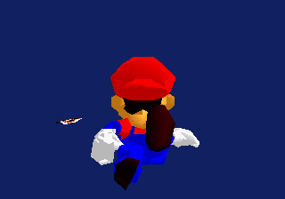

This replaces the translation-only actor staging with a close port of
`mtxf_rotate_xyz_and_translate`, `mtxf_mul`, and the source Animation
index/value channel cursor used by `geo_process_animated_part`. The evaluated
world pose is Y-up. It remains an intermediate gate, not a pose acceptance:
the later front-facing capture exposed a hierarchy-stack error in this first
evaluator. The C5 data and source geometry are valid; the local GeoLayout walk
was not yet restoring the parent matrix after a child subtree.

### M2 rejected: in-place eye tiles need affine subdivision

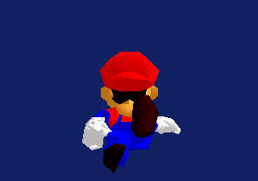

The source eye range is now regenerated after the Animation/GeoLayout pose and
replaces compiled primitives 146–152 in its original order; VDP1 Gouraud
remains active for all surrounding source primitives. This fixes the prior
overpaint boundary, but an individual repeated-vertex VDP1 distorted sprite
still does not approximate Fast3D's per-triangle UV interpolation closely
enough to show a legible eye. The next texture gate is adaptive UV subdivision
into smaller VDP1-safe tiles, not another screen-space overlay.

### M2 rejected: four-way UV subdivision has no visible contribution

The converter now emits four affine source-space subtriangles for each of the
11 original eye triangles (44 tiles total). The deterministic Ymir framebuffer
hash is exactly the Stage 36 hash, proving the selected eye patch does not
contribute visibly in this C5 presentation. This rules out simply increasing
tile density; the next gate is a source-facing standing frame/camera proof
before more texture commands are added.

### M2 rejected: face-facing camera still masks the eye patch

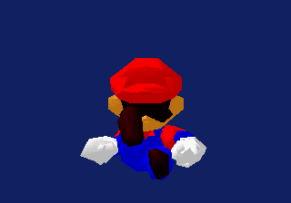

The source eye centroid establishes positive Z as the face direction, and the
zero-yaw capture has a distinct deterministic frame hash. It still lacks a
visible eye patch, ruling out camera direction and UV subdivision as the
immediate cause. M2 currently preserves source-stream primitive submission;
after articulated transforms, that is insufficient painter ordering. The next
required renderer gate is depth ordering of the transformed primitives before
the eye texture path can be judged visually.

### M2 intermediate: transformed depth buckets restore the body silhouette

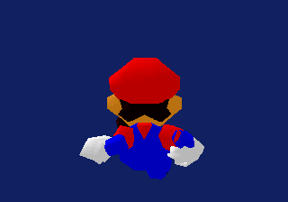

Submitting far transformed buckets before near buckets materially restores the
body silhouette and preserves the VDP1 Gouraud gradients. The capture is
still a rear presentation—so the eye patch being hidden is expected rather
than evidence against the texture converter. The next camera gate derives the
turntable front direction from the source face surface normal, rather than
the patch centroid alone.

### M2 rejected: front camera exposes a hierarchy-stack defect

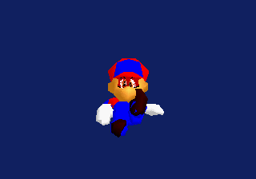

The wider, front-facing capture is retained as a rejected visual checkpoint.
It conclusively shows that the remaining problem is not camera distance or
face direction: later arm and leg siblings inherited transforms from earlier
child joints. The evaluator is now corrected to match SM64's
`geo_process_animated_part` push/recurse/pop stack discipline. A rebuilt
capture is required before any pose is called standing or accepted.

### M2 stack correction: rear view restores the articulated body

The first rebuilt capture removes the collapsed sibling transforms visible in
Stage 40. It provides an independent rear-view proof that the source cap,
torso, gloves, overalls, and feet now inherit their own intended joints.

### M2 accepted: source GeoLayout stack restores standing Mario

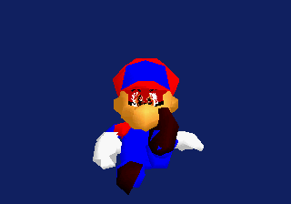

The rebuilt front view verifies the stack correction on target: the cap, face,
torso, arms, gloves, legs, and feet now remain attached to their intended
source hierarchy branches. The face includes the converted original eye-patch
texture, while the rest of the actor uses VDP1 Gouraud shading derived from
the actual compiled Mario geometry. This is the first accepted standing-body
pose; remaining M2 work is texture coverage and painter-quality refinement,
not a substitute geometry path.

### M2 texture coverage: five original Mario textures reach VDP1

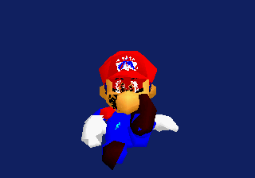

The adapter now tracks Fast3D `gsDPSetTextureImage` state through nested source
display lists, marks those source triangles unsafe for quad pairing, and
replaces each one in transformed painter order with four UV-baked VDP1 tiles.
This capture exercises 50 original textured source triangles (200 tiles): cap
logo, eyes, sideburns, mustache, and overalls buttons. The body remains source
geometry with VDP1 Gouraud shading. UV-tile seams and per-subtile ordering are
visible limitations to refine, not missing or invented texture data.

### M2 accepted: root rotation completes the source standing pose

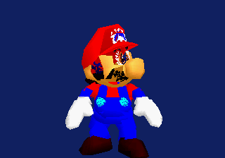

The final source-animation cursor correction is decisive. In SM64,
`geo_process_animated_part` consumes root translation and then its root
rotation in the *same* invocation. The earlier evaluator skipped that rotation,
offsetting every limb channel. With the true cursor order, the source C5 idle
places the head near +153 source Y and both feet near −125 source Y. This
BIOS-backed capture shows an upright Mario with source geometry, five local
ROM-derived texture sources, and native VDP1 Gouraud lighting together.

## Next visual gates

1. Expand the accepted eyelid evaluator to the remaining Goddard facial joints,
   then validate every animated quad over the selected pose range; retain the
   current local triangle fallback unless that proof permits a merge.
2. Finish deterministic remote release after the duration-aware Ymir hold;
   press detection is proven, while the final Saturn sample can remain latched.
3. Compare VDP1 command, Gouraud-table, CPU transform, and painter-sort budgets
   with the intended game-frame budget.
4. Evaluate the first source animation extrema through the deformation-aware
   quad safety gate and record any pairs that must fall back to triangles.
5. Replace M2's hand-authored neutral offsets with evaluated mario_geo_body
   transform nodes, then capture the accepted full Mario silhouette before
   texture or animation work begins.
