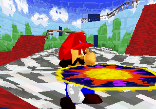
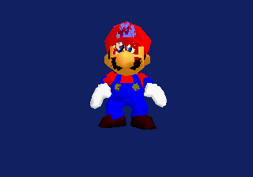

# E1 shared VDP1 backend checkpoint — 2026-07-19

Castle and the standalone source-Mario turntable now use the same Saturn
backend contracts:

- `gfx/saturn_vdp1_backend.h` owns persistent Yaul command-list allocation,
  fixed setup commands, bounded reservation, END placement, and live-prefix
  upload;
- `gfx/saturn_texture_residency.h` owns a capacity-checked VDP1 texture
  destination and the final SCU-DMA transfer used by linked, WRAM-staged, and
  4 MiB cartridge-staged sources.

Reference-code record:

- upstream: `yaul-org/libyaul`;
- pin: `6012f79f237773378c8014e70d8998ad95a38d98`;
- license: MIT;
- inspected: `libyaul/scu/bus/b/vdp/vdp1_cmdt.c`,
  `libyaul/scu/bus/b/vdp/vdp_sync.c`, and
  `libyaul/scu/bus/b/vdp/vdp1/cmdt.h`;
- reuse mode: dependency / direct public-API adaptation;
- behavior confirmed: `vdp1_sync_cmdt_list_put()` uploads exactly the live
  command count.

Jo Engine remains a pattern-only persistent-list reference at pinned commit
`556d081146211b6a1cfa6591d70f9487d406758b`; no Jo Engine allocator or renderer
source was copied.

Verification:

- 48 host-tool tests and the C11 runtime-contract executable pass;
- Castle and turntable SH-2 ELF entry points are `0x06004000`;
- Castle ISO SHA-256 remains
  `a49a253caf9a4fecac62c6c1464aae7735dfbd5a0e1f61a39176137bf669194e`;
- turntable ISO SHA-256 is
  `bacd57400cea6a96a50db4f1dcc969aaf77f9479ad6ff7c8eb787b49bb66fa86`;
- Castle's sequence-2400 framebuffer/PNG hashes exactly match Stage 116;
- the sequence-2400 turntable capture boots and displays the animated source
  actor through the shared backend.

