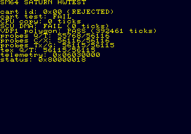

# Ymir BIOS event diagnostic reaches hwtest — 2026-07-17

This is superseded diagnostic history. The USA BIOS authenticated the disc and
read `A.BIN`; a paused-only write of zero to its shared event word at
`0x06020240` then dispatched the game program. The write was recorded by
`tools/saturn/capture_hwtest.py` as `event_word_poke: 0`. Follow-up testing
showed that the pause/resume, rather than the value, released a starved
CD-block host worker. Ymir commit `4d517116` fixes that scheduling issue, and
the clean replacement evidence is `ymir-bios-hwtest-2026-07-17.md`.

After that diagnostic handoff, the hwtest published valid `SAT0`/`SATX`
telemetry through cache-through WRAM at `0x06030000` and drew the final status
screen. This proves the relocated telemetry contract, Yaul image, and VDP1
probe sequence execute together under the BIOS-backed Ymir path.

The captured frame is 320x224, sequence 3300, with RGBA hash
`4bd3d8f1dc2e7219eb229af426bce881`. PNG SHA-256:
`0642db78ff484064062bbbc0afda0db98607e2bf6d07a12e435a99dbbaf9cb7f`.

Key decoded result fields:

- base magic `SAT0`, extended magic `SATX`, and complete bit set;
- VDP1 pass set, with all seven probe-mode bits set (`0x7F`);
- 28 VDP1 commands and a 28,672-pixel conservative estimate;
- no cart detected (`cart ID 0x00`), so the expected 0x5C/4 MiB cartridge
  gate, destructive RAM test, and cart DMA timings correctly remain rejected
  in this emulator-only capture.

The raw 120-byte telemetry has SHA-256
`c8fff0dbae69a805ef29545851f49fc30dc1587b8bdd417f6ca7a35933843c45`.
The machine-readable artifacts are:

- `docs/saturn/evidence/raw/ymir-event-poke-2026-07-17.bin`
- `docs/saturn/evidence/reports/ymir-event-poke-2026-07-17.json`

The zero-telemetry capture before the diagnostic write remains retained as
evidence of the Ymir boot-handoff issue in
`ymir-relocated-telemetry-2026-07-17.md`.
