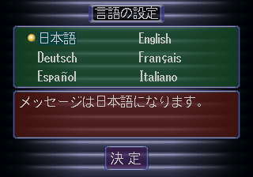

# Ymir visual capture after SlaveDriver DMA integration — 2026-07-17

This 320×224 RGBA8888 framebuffer was captured after 120 frames using the
rebuilt hardware-test disc, the supplied USA BIOS, and Ymir fork commit
`ab23d9ed`. The emulator reaches the BIOS language-selection screen, but the
disc program has not yet written `SAT0` telemetry at this point. Frame hash:
`94f1cbc999480d2209355b8cdeaa7ce0`.

This is emulator visual evidence only; it does not substitute for retail
hardware evidence or a valid telemetry decode.
